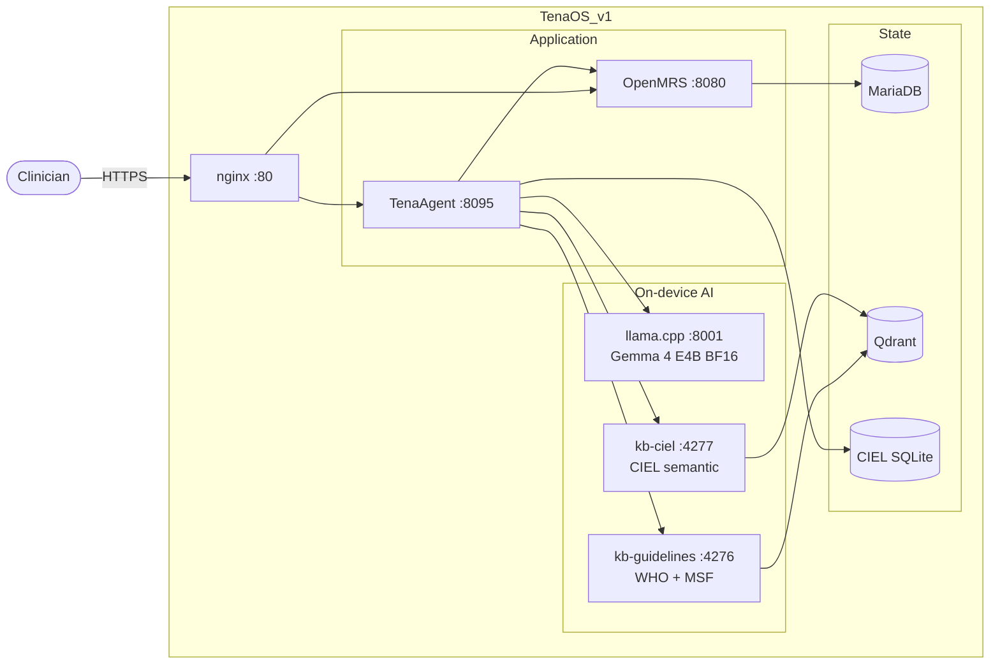

<div align="center">

# TenaOS

An AI-native clinical operating system for primary-care clinics in
low- and middle-income countries — built on OpenMRS, powered by
Gemma 4 E4B, deployed as a single Docker image.

[](LICENSE)
[](https://huggingface.co/google/gemma-4-E4B-it)
[](https://huggingface.co/beza4588/TenaOS)
[](https://openmrs.org/)
[](#quickstart)

</div>

---

TenaOS turns natural language into standards-based clinical workflows.
A clinical officer describes what they need; the agent searches CIEL and
the WHO/MSF knowledge base, drafts the artifact, validates it through
middleware, and hands final control back to the clinician.

**Gemma 4 E4B proposes. Middleware verifies. Clinicians approve.**

## Quickstart

TenaOS is designed to run as **one Docker container** with host-mounted
model and data artifacts. The setup wrapper fetches artifacts, writes
`.env`, validates Docker/GPU/ports/passwords, and starts the stack.

```bash
git clone https://github.com/brookyale0512/TenaOS.git
cd TenaOS
bash scripts/setup-demo.sh
```

Open the app when the container becomes healthy:

```bash
open http://localhost:8080
```

Demo credentials:

```text
Username: admin
Password: Admin123
```

If port `8080` is already in use:

```bash
bash scripts/setup-demo.sh --port 28061
```

The first boot restores Qdrant knowledge-base snapshots, initializes
OpenMRS, and waits for the `TenaOS_v1` container to become healthy
before reporting success.

Fresh demo installs also seed 50 synthetic patients with recent visits,
vitals, and clinical notes so users can immediately exercise patient
search, charts, queues, reports, notes, vitals, and AI workflows. The
records are generated locally and contain no real patient data.

## Artifacts On Hugging Face

The repository stays small. Large runtime artifacts are downloaded from
Hugging Face and bind-mounted at runtime.

| Artifact | Hugging Face repo | Purpose |
| --- | --- | --- |
| Gemma 4 E4B BF16 GGUF + mmproj | [`beza4588/TenaOS`](https://huggingface.co/beza4588/TenaOS) | On-device text + voice inference through `llama.cpp` |
| EmbedGemma 300M | [`google/embeddinggemma-300m`](https://huggingface.co/google/embeddinggemma-300m) | Dense retrieval embeddings for KB services |
| CIEL search SQLite | [`beza4588/tenaos-ciel-search-sqlite`](https://huggingface.co/beza4588/tenaos-ciel-search-sqlite) | Local terminology lookup and concept validation |
| Qdrant snapshots | [`beza4588/tenaos-qdrant-snapshots`](https://huggingface.co/beza4588/tenaos-qdrant-snapshots) | WHO/MSF guideline and CIEL semantic-search collections |

If a model requires license acceptance, run `hf auth login` and rerun the
setup script. The artifact fetcher is idempotent.

## What It Does

| Capability | Description |
| --- | --- |
| **Form builder** | Natural-language requests become CIEL-validated OpenMRS forms. |
| **AI scribe** | Voice or text becomes a SOAP note with coded observations. |
| **Decision support** | Recommendations are grounded in retrieved WHO/MSF evidence. |
| **Patient material** | Patient education drafts are generated in accessible language. |
| **Report builder** | Plain-language questions become deterministic FHIR query plans. |

## Architecture

One Docker image. Eight processes inside, supervised on container
localhost. Nothing leaves the container except through `:80`.



Both knowledge-base daemons load **EmbedGemma 300M** in-process and
share one Qdrant for hybrid (dense + BM25) retrieval. Model weights,
EmbedGemma, and the CIEL SQLite are bind-mounted from the host.

### Prerequisites

| | Minimum | Recommended |
|---|---|---|
| **OS** | Linux x86-64 | Ubuntu 22.04+ |
| **GPU** | NVIDIA, compute ≥ 8.0 (Ampere) | A100 / RTX 40-series |
| **GPU VRAM** | 16 GB (BF16 Gemma 4 E4B fits comfortably) | 24 GB+ for headroom |
| **System RAM** | 16 GB | 32 GB |
| **Disk** | 30 GB free (weights + image + DB) | 100 GB |
| **Docker** | 24.0+ with `nvidia-container-toolkit` | latest |

### Manual Setup

```bash
bash scripts/fetch-models.sh
cp demo.env.example .env
# Edit .env: rotate OPENMRS_*_PASSWORD and paste the printed artifact paths.
docker compose up -d
```

To self-host artifacts on your own Hugging Face org, override
`TENAOS_HF_GEMMA_REPO`, `TENAOS_HF_CIEL_REPO`, `TENAOS_HF_QDRANT_REPO`,
or `TENAOS_HF_EMBED_REPO` before running `fetch-models.sh`.

## Components

| Directory | Role |
|---|---|
| [`TenaOS-Frontend/`](TenaOS-Frontend/) | React + Vite clinical workspace |
| [`TenaOS-Backend/`](TenaOS-Backend/) | OpenMRS Reference Application 3 distribution |
| [`TenaAgent/`](TenaAgent/) | Python agent service — prompts, tool loops, OpenMRS writers |
| [`TenaOS-LLM/`](TenaOS-LLM/) | `llama.cpp` CUDA server (Gemma 4 E4B BF16 GGUF) |
| [`TenaOS-KnowledgeBase/`](TenaOS-KnowledgeBase/) | Qdrant + EmbedGemma retrieval daemon |
| [`TenaOS-CIEL/`](TenaOS-CIEL/) | CIEL terminology — SQLite + FTS5 |
| [`docker/`](docker/) | `supervisord`, internal nginx, start scripts |
| [`models/`](models/) | Bind-mounted GGUF weights (gitignored) |

Each top-level component has a README with the same
**Purpose / Build / Run / Test / Environment** shape.

## Models

| Component | Model |
|---|---|
| Generation | [`google/gemma-4-E4B-it`](https://huggingface.co/google/gemma-4-E4B-it) — BF16 GGUF |
| Embeddings | [`google/embeddinggemma-300m`](https://huggingface.co/google/embeddinggemma-300m) |

Standardized on BF16 full precision. Native audio rides on Gemma 4's
`mmproj` projector through `llama.cpp`.

## Safety boundary

TenaOS does not treat the model as an authority.

- Tool calls are allow-listed; the model can only do what the
  middleware exposes.
- Medical concepts are validated locally against CIEL before any write.
- Final writes go through OpenMRS, never directly through the model.
- Recommendations cite retrieved evidence; unsupported answers do not
  appear.
- Every reasoning trace and tool call is auditable in the UI.

The agent never writes to OpenMRS directly. Every clinical change is a
draft a human approves.

## Status

TenaOS is a research and challenge-submission codebase. It is the live
software behind [demo.tenaos.com](https://demo.tenaos.com).

It is not a HIPAA-regulated product, not a CE-marked or FDA-cleared
medical device, and not safety-of-life software. Operators deploying
TenaOS in real clinical settings remain responsible for local
regulatory compliance and clinical risk management.

## License

Apache 2.0 — see [`LICENSE`](LICENSE).

## Acknowledgments

Built on
[OpenMRS](https://openmrs.org/),
[Gemma 4](https://ai.google.dev/gemma) and
[EmbedGemma](https://huggingface.co/google/embeddinggemma-300m),
[llama.cpp](https://github.com/ggerganov/llama.cpp),
[Qdrant](https://qdrant.tech/),
[CIEL](https://openconceptlab.org/orgs/CIEL),
[WHO SMART Guidelines](https://www.who.int/teams/digital-health-and-innovation/smart-guidelines),
and the [MSF clinical guidelines](https://medicalguidelines.msf.org/).
