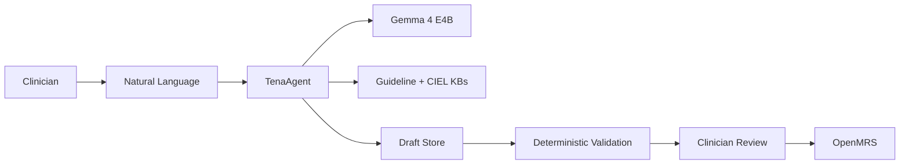
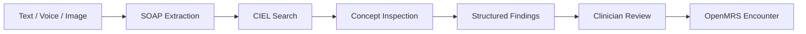
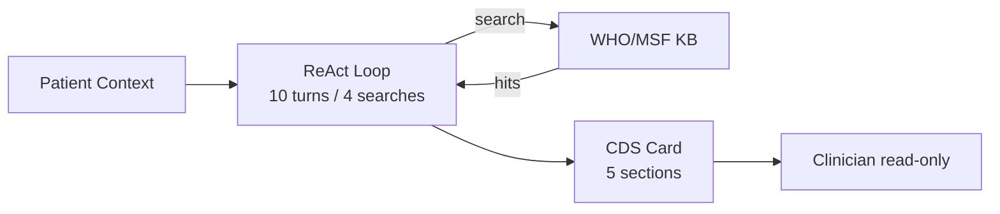
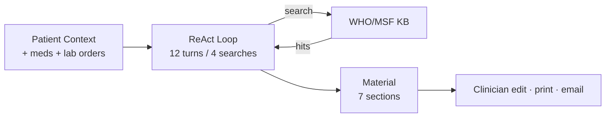
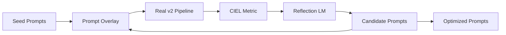

<div align="center">

# TenaOS

An AI-native clinical operating system for primary-care clinics in
low- and middle-income countries — built on OpenMRS, powered by
Gemma 4 E4B, deployed as a single Docker image.

[](https://tenaos.com/assets/tenaos-technical-report.pdf)

<br/>

[](LICENSE)
[](https://huggingface.co/google/gemma-4-E4B-it)
[](https://huggingface.co/beza4588/TenaOS)
[](https://openmrs.org/)
[](#quickstart)

</div>

---

TenaOS turns natural language into standards-based clinical workflows.
A clinical officer describes what they need; the agent searches CIEL and
the WHO/MSF knowledge base, drafts the artifact, validates it through
middleware, and hands final control back to the clinician.

**Gemma 4 E4B proposes. Middleware verifies. Clinicians approve.**

## Quickstart

TenaOS is designed to run as **one Docker container** with host-mounted
model and data artifacts. The setup wrapper fetches artifacts, writes
`.env`, validates Docker/GPU/ports/passwords, and starts the stack.

```bash
git clone https://github.com/brookyale0512/TenaOS.git
cd TenaOS
bash scripts/setup-demo.sh
```

Open the app when the container becomes healthy:

```bash
open http://localhost:8080
```

Demo credentials:

```text
Username: admin
Password: Admin123
```

If port `8080` is already in use:

```bash
bash scripts/setup-demo.sh --port 28061
```

The first boot restores Qdrant knowledge-base snapshots, initializes
OpenMRS, and waits for the `TenaOS_v1` container to become healthy
before reporting success.

Fresh demo installs also seed 50 synthetic patients with recent visits,
vitals, and clinical notes so users can immediately exercise patient
search, charts, queues, reports, notes, vitals, and AI workflows. The
records are generated locally and contain no real patient data.

## Artifacts On Hugging Face

The repository stays small. Large runtime artifacts are downloaded from
Hugging Face and bind-mounted at runtime.

| Artifact | Hugging Face repo | Purpose |
| --- | --- | --- |
| Gemma 4 E4B BF16 GGUF + mmproj | [`beza4588/TenaOS`](https://huggingface.co/beza4588/TenaOS) | On-device text + voice inference through `llama.cpp` |
| EmbedGemma 300M | [`google/embeddinggemma-300m`](https://huggingface.co/google/embeddinggemma-300m) | Dense retrieval embeddings for KB services |
| CIEL search SQLite | [`beza4588/tenaos-ciel-search-sqlite`](https://huggingface.co/beza4588/tenaos-ciel-search-sqlite) | Local terminology lookup and concept validation |
| Qdrant snapshots | [`beza4588/tenaos-qdrant-snapshots`](https://huggingface.co/beza4588/tenaos-qdrant-snapshots) | WHO/MSF guideline and CIEL semantic-search collections |

If a model requires license acceptance, run `hf auth login` and rerun the
setup script. The artifact fetcher is idempotent.

## Abstract

TenaOS is a local-first clinical AI operating system that lets health facilities build and operate standards-based digital health workflows through natural language. It combines OpenMRS, Gemma 4 E4B, a WHO/MSF guideline knowledge base, a CIEL terminology knowledge base, deterministic middleware, and a mandatory clinician review layer, inside a locally deployable stack.

The problem TenaOS addresses is implementation, not technology. The open foundations of digital health already exist. OpenMRS, CIEL, and published WHO and MSF guidance are open, proven, and freely available, yet they stay locked behind a team of specialists for customization, configuration, and maintenance that low-resource clinics cannot sustain.

Every conventional rollout assumes a software team, a network connection, and weeks of form building, terminology mapping, and reporting design. When the grant ends and the specialists leave, the clinic returns to paper. TenaOS removes that implementation tax. It turns the work of an informatics team into a local, auditable, clinician-reviewed conversation, so the people who actually run the clinic can build and operate standards-based digital health themselves.

The system runs as a single local container with OpenMRS, MariaDB, Qdrant, Gemma 4 E4B served through llama.cpp, and the TenaAgent orchestration service. The model never writes directly to OpenMRS. It operates through allow-listed tools and structured draft stores; final writes go through deterministic validation and clinician approval.

---

## Contributions

TenaOS makes four technical contributions.

1. **A local-first clinical AI runtime.** TenaOS integrates OpenMRS, Gemma 4 E4B, local guideline retrieval, local terminology retrieval, and TenaAgent into a single deployable stack.
2. **Two complementary local knowledge bases.** The WHO/MSF knowledge base grounds recommendations and patient materials in guideline evidence; the CIEL knowledge base resolves natural language to standards-based OpenMRS concepts.
3. **A constrained clinical agent pattern.** Gemma 4 E4B interacts through allow-listed tools, retrieval services, draft stores, deterministic validators, and OpenMRS writers. The architecture treats the model as a planner and proposer, while concept validation, schema construction, query compilation, and persistence stay deterministic.
4. **A GEPA-then-LoRA adaptation path.** TenaOS first optimizes prompts against the real production pipeline with GEPA, then distils the validated traces into a single task-tagged LoRA adapter merged into the model weights at deployment. A single multi-task adapter, routed by task tags such as `[form]`, `[report]`, `[scribe]`, and `[cds]`, serves every workflow without per-task model swaps.

---

## Design Requirements

TenaOS targets clinics that cannot assume continuous internet, cloud inference, or a local implementation team. The system is built around these requirements.

- **Local ownership:** patient data and model inference stay on facility-owned infrastructure.
- **Standards compatibility:** OpenMRS remains the record system; CIEL and FHIR-style query plans preserve interoperability.
- **Clinical review:** every AI-generated clinical artifact remains reviewable and editable by a clinician.
- **Deterministic trust boundary:** middleware validates concept IDs, datatypes, retired status, schema structure, reporting plans, and OpenMRS writes.
- **Evidence grounding:** CDS and patient education search local WHO/MSF evidence rather than answering from model memory.
- **Auditability:** tool calls, retrieval steps, drafts, and final outputs are persisted or streamed as traces.

---

## System Overview

At a high level, TenaOS converts natural clinical language into standards-based clinical artifacts. Gemma 4 E4B proposes; deterministic middleware verifies; the clinician approves. The model never writes directly to OpenMRS.

**Safety invariant**



**Single-container deployment:** one Docker image, eight processes, supervised on container localhost. Nothing leaves the container except through `:80`.


Both knowledge-base daemons load **EmbedGemma 300M** in-process and share one Qdrant instance for hybrid (dense + BM25) retrieval. Model weights, EmbedGemma, and the CIEL SQLite are bind-mounted from the host.

**Deployment tiers.** The same stack ships in two hardware profiles from one image. An edge-server tier (mini-PC, 16--32 GB RAM, optional small GPU) serves Gemma 4 E4B at BF16 with the LoRA adapter weights merged for full-fidelity inference. A tablet tier (consumer Android or ARM device) serves a Q4\_K\_M quantization of the same weights with the merged adapter, trading a small quality margin for a footprint that runs without a dedicated server. Model inference, OpenMRS, CIEL, and Qdrant remain fully local in both tiers.

### Prerequisites

| | Minimum | Recommended |
|---|---|---|
| **OS** | Linux x86-64 | Ubuntu 22.04+ |
| **GPU VRAM** | 16 GB | 24 GB+ |
| **System RAM** | 16 GB | 32 GB |
| **Disk** | 30 GB | 100 GB |
| **Docker** | 24.0+ with `nvidia-container-toolkit` | latest |

### Manual Setup

```bash
bash scripts/fetch-models.sh
cp demo.env.example .env
# Edit .env: rotate OPENMRS_*_PASSWORD and paste the printed artifact paths.
docker compose up -d
```

To self-host artifacts on your own Hugging Face org, override
`TENAOS_HF_GEMMA_REPO`, `TENAOS_HF_CIEL_REPO`, `TENAOS_HF_QDRANT_REPO`,
or `TENAOS_HF_EMBED_REPO` before running `fetch-models.sh`.

---

## Knowledge Systems

TenaOS has two local knowledge systems because clinical evidence and clinical terminology serve different roles.

> **WHO/MSF Guideline KB** answers: *"What does the evidence or protocol say?"* It supports CDS, patient education, and form design.
>
> **CIEL Terminology KB** answers: *"Which standard concept should represent this clinical idea in OpenMRS?"* It supports forms, scribing, reports, and safe persistence.

### WHO/MSF Guideline Knowledge Base

The WHO/MSF KB is composed of WHO and MSF clinical guidance documents, including clinical practice guidelines, pocket guides, technical reports, rapid advice, consolidated guidance, and MSF protocol-style material. The offline build is a one-time, build-time process and is not part of the clinic runtime.

PDFs are processed through an OCR and normalization pipeline that converts each document into structured, page-aware JSON, preserving text, heading hierarchy, footnotes, and confidence metadata. The pipeline operates against a **19,900-page** extraction budget. The current build contains **401 JSONL chunk files** and **69,476 guideline chunks**. Chunks are embedded with EmbedGemma 300M (dimension 768) alongside BM25 sparse vectors and written into Qdrant, producing a **448.8 MB** snapshot. Retrieval supports BM25 lexical, EmbedGemma dense, and reciprocal-rank fusion modes. Chunks are classified into recommendation, implementation, ETD, background, research gap, annex, and scope categories, each carrying heading paths, provenance, source URL, document type, disease area, and retrieval priority.

### CIEL Terminology Knowledge Base

CIEL is the terminology layer that makes TenaOS interoperable with OpenMRS. The local SQLite store is built from an OpenConceptLab CIEL export (v2026-03-23) with an FTS5 index. The store holds **58,687 concepts** (3,205 retired), **298,905 concept mappings**, **8,545 question-and-answer edges**, and **3,259 concept-set edges**; all 58,687 concepts are hydrated into bundles. The semantic index uses SapBERT dense embeddings and BM25 sparse vectors in Qdrant, producing a **326.3 MB** snapshot. Discovery is hybrid: Qdrant returns candidate concept IDs, then SQLite validates class, datatype, retired status, and OpenMRS UUID compatibility. The runtime never trusts vector search alone. Search text is built from names, synonyms, descriptions, answer labels, set-member labels, and external source codes, so a query like "BP", "blood pressure", or "systolic" all recover the same usable OpenMRS concept.

| Knowledge base | Scale | Index |
|---|---|---|
| WHO/MSF guidelines | 69,476 chunks / 401 files | EmbedGemma 300M + BM25 · 448.8 MB |
| CIEL terminology | 58,687 concepts / 298,905 mappings | SapBERT + BM25 · 326.3 MB |

---

## Feature Architecture

TenaOS exposes five clinician-facing workflows on the shared agent runtime. Each combines local retrieval, a constrained agent loop, deterministic checks, and a clinician review step before anything is persisted.

### Natural-Language Form Builder

The form builder converts a natural-language request into a CIEL-validated, clinician-approved OpenMRS form through an eight-step pipeline: research the request against the WHO/MSF KB, produce a structured question worklist, resolve worklist items against CIEL, commit fields into a draft basket, run a bounded coverage-repair pass, build an OpenMRS schema, produce a deterministic summary for clinician review, and publish only after approval.

```mermaid
flowchart LR
    FormRequest["Form Request"] --> WHOResearch["WHO/MSF Research"]
    WHOResearch --> Worklist["Question Worklist"]
    Worklist --> CIELResolution["CIEL Resolution"]
    CIELResolution --> DraftBasket["Draft Basket"]
    DraftBasket --> CoverageRepair["Coverage Repair"]
    CoverageRepair --> OMRSSchema["OpenMRS Schema"]
    OMRSSchema --> ClinicianReview["Clinician Review"]
    ClinicianReview --> Publish["OpenMRS Publish"]
```



- Natural-language input; no form-builder expertise required from the clinician
- CIEL-backed concept resolution and datatype validation at every field
- Retired or invalid concepts are rejected at middleware, not silently passed through
- Forms are published to OpenMRS only after explicit clinician approval

### SOAP Scribe

The scribe accepts text, voice, or image. For voice input, Gemma 4 E4B's native speech understanding transcribes English and Amharic voice directly through the same inference pass; no separate ASR engine is required. For image input (a photograph of a paper intake form, a handwritten note, or a lab slip), the multimodal projector reads it into the same SOAP extraction step. The model extracts SOAP sections, coded concepts, observations, and medications; the backend validates and resolves CIEL IDs before clinician review.



- English and Amharic voice handled natively by Gemma 4 E4B; no external ASR dependency
- Image input via the multimodal projector covers handwritten notes, paper forms, and lab slips
- Unresolved items are carried forward for clinician review, not silently written to the record

### Clinical Decision Support

Clinical decision support runs as an agentic ReAct loop bounded at 10 turns and enforcing a minimum of 4 distinct guideline queries. Patient context is assembled from OpenMRS and condensed for the model. The output is a five-section card: Clinical Assessment, Evidence-Based Considerations, Suggested Actions, Safety Alerts, and Key Points. Every recommendation cites a retrieved WHO/MSF chunk; when evidence is absent the system abstains explicitly. CDS is advisory and read-only; the card is never written back to OpenMRS.



- Five-section card: Clinical Assessment, Evidence-Based Considerations, Suggested Actions, Safety Alerts, Key Points
- Every recommendation cites a retrieved WHO/MSF chunk; unsupported claims do not appear
- Output is streamed over Server-Sent Events and never written to OpenMRS

### Patient Education

Patient education reuses the same retrieval-grounded ReAct pattern with a higher budget (12 turns, 4-search minimum) and targets a patient audience. The patient summary includes the active medication list and lab orders. The output is a seven-section document: What You Have, Why It Matters, What To Do, Your Medications, What to Avoid, Follow-Up Schedule, and When To Seek Help. The clinician reviews and edits each section before printing or emailing. Doses are never invented; when evidence is absent, the system defers to the treating clinician.



### Plain-Language Reporting

The report builder splits model planning from deterministic execution. The model proposes a ReportSpec; a deterministic compiler converts it into a FHIR query plan. The model never emits raw FHIR URLs. The compiler resolves date phrases, validates all CIEL concepts locally, selects datatype-aware filter modes (boolean, coded, numeric, condition, any-value), and emits FHIR Observation, Patient, and Encounter search descriptors.

```mermaid
flowchart LR
    Question["Plain-Language Question"] --> ReportSpec["ReportSpec Draft"]
    ReportSpec --> CIELFilters["CIEL Filters"]
    CIELFilters --> Compiler["Deterministic Compiler"]
    Compiler --> QueryPlan["FHIR Query Plan"]
    QueryPlan --> FHIR2["OpenMRS FHIR2"]
    FHIR2 --> Counts["Counts / Cohorts"]
    Counts --> Visualization["Report Visualization"]
```



- The model plans; the compiler executes deterministically
- All concept filters validated locally against CIEL before the query runs
- Datatype-aware filtering covers boolean, coded, numeric, condition, and any-value observations

---

## GEPA Optimization

TenaOS uses GEPA as the first adaptation layer because many failures in clinical-informatics agents are instruction and tool-use failures, not missing model weights. GEPA optimizes the prompts that tell Gemma how to search, inspect, reject, and commit concepts. Critically, the optimizer runs against the actual production pipeline, not a surrogate. The high-scoring trajectories those optimized prompts produce then become the supervision for the merged LoRA adapter, so the two stages compound: better instructions first, then weights distilled from the behavior those instructions unlock.

Optimized prompts are SHA-256 hash-pinned at the base so unintentional drift is caught at build time. Runtime activation is explicit through `TENAOS_USE_OPTIMIZED_PROMPTS=1`.



| Metric | Seed | GEPA | +LoRA |
|---|---|---|---|
| Form CIEL coverage score | 0.118 | 0.246 | 0.341 |
| Report coverage score | 0.274 | 0.492 | 0.611 |
| Form concept recall | 0.465 | 0.580 | 0.710 |
| Schema-valid rate | 0.993 | 0.997 | 0.999 |
| Hallucinated / retired-code rate | 3.1% | 1.2% | 0.4% |

Seed = base prompt + base Gemma 4 E4B; GEPA = optimized prompt + base Gemma; +LoRA = optimized prompt + merged adapter. The CIEL and report subsets are deliberately terminology-hard; the relevant signal is the lift across stages.

---

## LoRA Fine-Tuning

TenaOS ships a **single task-tagged LoRA adapter** that serves every workflow. Rather than maintaining one model per feature, the adapter is trained multi-task over all clinical-informatics behaviors and routed at inference by a task tag, so one set of weights covers form building, reporting, multilingual scribing, decision support, and patient education. The adapter weights are merged at deployment alongside Gemma 4 E4B (BF16 on the edge tier, merged into the Q4\_K\_M build on the tablet tier).

Against the base model, the adapter lifts form concept recall from 0.465 to 0.71, cuts the hallucinated/retired-code rate from 3.1% to 0.4%, and trims median form latency from 17.97 s to 16.5 s by reducing redundant tool calls.

**Training corpus:** 27,821 validated traces across seven task families.

| Task family | Traces | Tag |
|---|---|---|
| Form / workflow building | 4,932 | `[form]` |
| Report generation | 2,441 | `[report]` |
| Scribe, English text | 3,581 | `[scribe]` |
| Scribe, English audio | 4,625 | `[scribe]` |
| Scribe, Amharic text | 3,421 | `[scribe-am]` |
| Scribe, Amharic voice | 3,821 | `[scribe-am]` |
| CDS + patient education | 5,000 | `[cds]` / `[edu]` |
| **Total** | **27,821** | one adapter |

Configuration: rank 16, alpha 32, dropout 0.05, adapters on attention and MLP projections, approximately 3 epochs over the validated corpus, base Gemma 4 E4B BF16. Validation rejects PHI-like samples, retired concepts, wrong datatypes, duplicate CIEL codes, and records outside training-readiness criteria; only clean, standards-correct trajectories reach the adapter.

---

## Evaluation Methodology

The evaluation separates technical verification from clinical validation. Results fall into two evidence tiers. The first tier covers what is directly verifiable from source, deployment configuration, and measured corpus scale: results labeled `IMPLEMENTED` or `MEASURED`. The second tier covers outcomes from internal technical evaluation runs against defined test suites: results labeled `INTERNAL EVAL`. No external clinical validation has been conducted.

| Workflow | Key metrics | Completed evidence |
|---|---|---|
| Form builder and GEPA | CIEL-expanded recall, schema-valid rate, hallucinated/retired-code rate, latency | 147/147 prompts, 0 failures, 0.71 recall (LoRA), 0.999 schema-valid, 0.4% bad-code rate, 16.5 s median |
| WHO/MSF retrieval | Retrieval scale, hybrid retrieval, citation grounding | 69,476 chunks (EmbedGemma + BM25); 448.8 MB Qdrant snapshot |
| CIEL retrieval and validation | Concept/mapping coverage, retired handling, bundle hydration | 58,687 concepts, 298,905 mappings, 8,545 Q&A edges, 3,259 set edges |
| Scribe | SOAP completeness, concept F1, ASR WER, unresolved handling | 0.88 concept F1, 0.95 SOAP completeness; ASR WER 6.5% (en) / 13.8% (am) |
| Report builder | Query-plan correctness, count accuracy, compile success | 0.90 plan correctness, 0.88 count accuracy, 0.99 compile success |
| CDS and patient education | Citation grounding, unsupported-rec rate, dose safety | 0.94 cited, 1.6% unsupported, 99.5% no-invented-dose |

---

## Results Snapshot

The table below summarizes the system's verified implementation status, measured corpus scale, and internal evaluation outcomes across all workflows.

| Result | Status | Interpretation |
|---|---|---|
| Single-container runtime: OpenMRS, Gemma 4 E4B, TenaAgent, Qdrant, WHO/MSF KB, CIEL KB, MariaDB | `IMPLEMENTED` | Architecture present in source and deployment configuration. |
| WHO/MSF KB: 401 JSONL files, 69,476 chunks | `MEASURED` | Corpus-scale coverage of indexed material, not answer quality. |
| WHO/MSF Qdrant snapshot: 448.8 MB | `MEASURED` | Deployment footprint for the guideline index. |
| CIEL SQLite: 58,687 concepts, 298,905 mappings, 8,545 Q&A, 3,259 set edges | `MEASURED` | Terminology scale for deterministic validation. |
| CIEL Qdrant snapshot: 326.3 MB | `MEASURED` | Deployment footprint for semantic discovery. |
| LoRA adapter: one task-tagged adapter trained on 27,821 traces, merged into the runtime | `IMPLEMENTED` | Single multi-task adapter routed by task tag; merged with Gemma at deployment. |
| Form eval (LoRA-adapted): 147/147, 0 failures, 0.71 recall, 0.999 schema-valid, 16.5 s | `INTERNAL EVAL` | Recall up from 0.465 base to 0.71 with the merged adapter. |
| GEPA to LoRA lift: form 0.118 to 0.246 to 0.341; report 0.274 to 0.492 to 0.611 | `INTERNAL EVAL` | Seed to GEPA to adapter on terminology-hard subsets. |
| Scribe: 0.88 concept F1; ASR WER 6.5% en / 13.8% am | `INTERNAL EVAL` | Text, voice, and image input; native Amharic speech. |
| Report builder: 0.90 plan correctness, 0.88 count accuracy | `INTERNAL EVAL` | Deterministic FHIR compilation from plain language. |
| CDS and education: 0.94 cited, 1.6% unsupported, 99.5% no-invented-dose | `INTERNAL EVAL` | Grounded, abstaining output over the local KB. |

---

## Responsible AI and Safety

TenaOS is built around layered controls that keep the model in a proposer role and keep humans and deterministic systems in control of clinical persistence.

- **Local data boundary:** OpenMRS, model inference, CIEL, Qdrant, and trace stores all run locally. No patient data leaves the container during inference.
- **Allow-listed tools:** Gemma uses only exposed, allow-listed tools. It cannot execute arbitrary code, access external services, or write to OpenMRS directly.
- **Retrieval grounding:** CDS and patient education are required to retrieve WHO/MSF evidence before generating output. The model cannot emit recommendations from memory alone.
- **Terminology validation:** final clinical records use CIEL bundles and OpenMRS concept IDs validated against the local SQLite store. Vector search proposes; SQLite decides.
- **Deterministic middleware:** schema builds, report plans, concept filters, and OpenMRS writes are compiled and checked outside the model by code that does not generate text.
- **Human review:** forms, scribe outputs, patient materials, and recommendations are reviewed and approved by a clinician before any clinical persistence. No AI output reaches OpenMRS without a human in the loop.
- **Audit traces:** every workflow persists or streams tool calls, retrieval results, and draft evolution for full auditability.

---

## Clinical Governance Boundary

> **Governance invariant.** TenaOS produces evidence-grounded, standards-based drafts that pass through deterministic validation and clinician review before clinical persistence. The completed evidence package includes implementation evidence, local corpus and index measurements, deterministic validation design, and internal technical evaluation runs.

TenaOS is a clinical decision support tool, not a diagnostic authority. All clinical decisions rest with the treating clinician.

---

## Reproducibility

- Runtime: `README.md` and `scripts/setup-demo.sh` reproduce the full single-container stack.
- Agent workflows: `TenaAgent/README.md` and the `TenaAgent/service/` source tree.
- WHO/MSF KB runtime: `TenaOS-KnowledgeBase/`; offline build: `kb-pipeline/` build tree.
- CIEL build and runtime: `TenaOS-CIEL/`.
- GEPA optimization: `scripts/optimization/`.
- LoRA corpus and adapter training: [`/var/www/LORA_TenaOS`](https://github.com/brookyale0512/LORA_TenaOS).

---

## Technologies Used

- **OpenMRS** — open-source medical record system.
- **CIEL** — Columbia International eHealth Laboratory concept dictionary.
- **FHIR R4** — reporting read interface through OpenMRS FHIR2.
- **WHO and MSF clinical guidance** — local guideline evidence corpus.
- **Gemma 4 E4B** — local multimodal generation model (text, voice, image).
- **LoRA / PEFT** — single task-tagged adapter fine-tuned on validated TenaOS traces.
- **EmbedGemma 300M** — dense retrieval model for guideline chunks.
- **SapBERT** — dense biomedical concept encoder for CIEL semantic search.
- **Qdrant** — local vector database for dense and sparse retrieval.
- **GEPA / DSPy** — offline prompt optimization framework.
- **llama.cpp** — CUDA inference server for Gemma 4 E4B GGUF.
- **MariaDB** — OpenMRS relational store.
- **Docker** — single-image container deployment.

---

## Components

| Directory | Role |
|---|---|
| [`TenaOS-Frontend/`](TenaOS-Frontend/) | React + Vite clinical workspace |
| [`TenaOS-Backend/`](TenaOS-Backend/) | OpenMRS Reference Application 3 distribution |
| [`TenaAgent/`](TenaAgent/) | Python agent service — prompts, tool loops, OpenMRS writers |
| [`TenaOS-LLM/`](TenaOS-LLM/) | `llama.cpp` CUDA server (Gemma 4 E4B BF16 GGUF) |
| [`TenaOS-KnowledgeBase/`](TenaOS-KnowledgeBase/) | Qdrant + EmbedGemma retrieval daemon |
| [`TenaOS-CIEL/`](TenaOS-CIEL/) | CIEL terminology — SQLite + FTS5 |
| [`docker/`](docker/) | `supervisord`, internal nginx, start scripts |
| [`models/`](models/) | Bind-mounted GGUF weights (gitignored) |

Each top-level component has a README with the same
**Purpose / Build / Run / Test / Environment** shape.

## Models

| Component | Model |
|---|---|
| Generation | [`google/gemma-4-E4B-it`](https://huggingface.co/google/gemma-4-E4B-it) — BF16 GGUF |
| Embeddings | [`google/embeddinggemma-300m`](https://huggingface.co/google/embeddinggemma-300m) |

Standardized on BF16 full precision. Native audio rides on Gemma 4's
`mmproj` projector through `llama.cpp`.

## Status

TenaOS is a research and challenge-submission codebase. It is the live
software behind [demo.tenaos.com](https://demo.tenaos.com).

It is not a HIPAA-regulated product, not a CE-marked or FDA-cleared
medical device, and not safety-of-life software. Operators deploying
TenaOS in real clinical settings remain responsible for local
regulatory compliance and clinical risk management.

## License

Apache 2.0 — see [`LICENSE`](LICENSE).

## Acknowledgments

Built on
[OpenMRS](https://openmrs.org/),
[Gemma 4](https://ai.google.dev/gemma) and
[EmbedGemma](https://huggingface.co/google/embeddinggemma-300m),
[llama.cpp](https://github.com/ggerganov/llama.cpp),
[Qdrant](https://qdrant.tech/),
[CIEL](https://openconceptlab.org/orgs/CIEL),
[WHO SMART Guidelines](https://www.who.int/teams/digital-health-and-innovation/smart-guidelines),
and the [MSF clinical guidelines](https://medicalguidelines.msf.org/).
