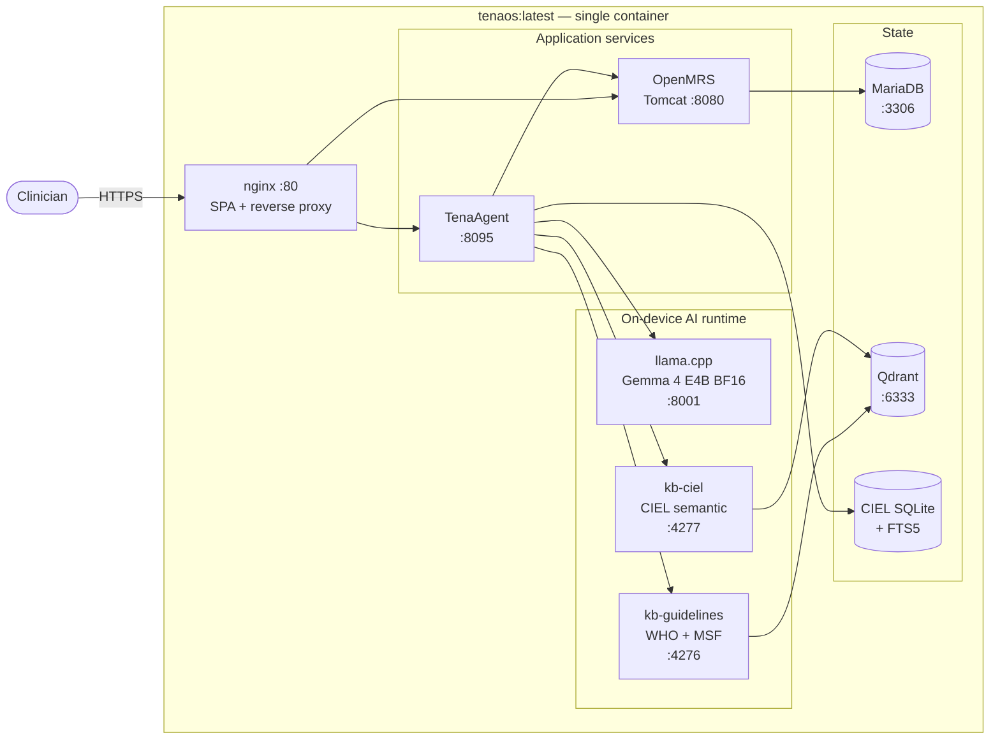

<div align="center">

# TenaOS

### The clinical operating system that lets clinics build digital health infrastructure in their own language.

[](LICENSE)
[](https://huggingface.co/google/gemma-4-E4B-it)
[](https://openmrs.org/)
[](#five-minute-demo)
[](#status)

</div>

---

## The implementation gap

Every year, health ministries and donors invest billions trying to digitize
primary-care clinics in emerging markets. The story usually ends the same
way: a pilot launches, a grant-funded technical team configures forms,
trains staff, maps medical concepts, and keeps the system alive. For a
while, the clinic is digital. Then the grant ends, the engineers leave,
and the clinic returns to paper.

The failure is not that clinicians reject technology. It is that digital
health has been built as if every clinic has a software team.

A usable electronic medical record in a low-resource clinic requires
someone who understands local clinical workflows, someone fluent in
medical terminology standards, someone who can configure OpenMRS forms,
someone who can map local language to CIEL/ICD-10/SNOMED/LOINC, and
someone who can build reports for facility managers and ministries. The
clinics that need digital records most are exactly the clinics least
able to afford that team.

The world already has strong digital health foundations.
[OpenMRS](https://openmrs.org/) is open source, trusted, deployed across
thousands of facilities. [CIEL](https://openconceptlab.org/orgs/CIEL)
provides a standardized medical vocabulary tuned for LMIC primary care.
[WHO](https://www.who.int/teams/digital-health-and-innovation/smart-guidelines)
and [MSF](https://medicalguidelines.msf.org/) publish clear clinical
guidelines. The pieces exist — but they are locked behind implementation
expertise.

Clinicians speak the language of care: *"I need a triage form."* *"This
child has fever and cough."* *"Show me patients with TB symptoms this
month."* Digital health systems speak another language: concept IDs,
schemas, encounter types, FHIR queries, coded observations, and reporting
logic.

**That gap is where digital health pilots die. TenaOS closes it.**

---

## What TenaOS does

TenaOS is an AI-native clinical operating system built on OpenMRS and
powered by [Gemma 4 E4B](https://ai.google.dev/gemma). It lets a clinic
turn natural language into locally owned, standards-based health data —
**without an implementation team, internet connection, or technical
background**.

Gemma 4 E4B runs entirely on-device, on a low-cost edge server or Android
tablet, with no cloud dependency. Its four-billion-parameter efficiency
makes this possible in facilities with unreliable power and no internet.
Its native multimodality handles text, voice, and medical images within
a single inference pass, eliminating the need for separate ASR, vision,
and language pipelines. And its instruction-following precision makes it
well-suited to the constrained, tool-driven reasoning that clinical
safety requires.

Instead of asking a clinic to find engineers, TenaOS gives the clinic a
conversation. A clinical officer describes the workflow they need.
Gemma 4 E4B plans the artifact, searches the local CIEL medical
dictionary, inspects candidate concepts, and builds a validated OpenMRS
form. The clinician reviews the reasoning and publishes only when ready.
What once required XML, informatics expertise, and weeks of configuration
becomes a guided clinical conversation.

---

## Architecture

TenaOS ships as **one Docker image**. Inside, `supervisord` orchestrates
eight processes on the container's localhost; nothing leaves the
container except through `:80`. The whole stack runs on a single edge
server with an NVIDIA GPU.



Both knowledge-base daemons load **EmbedGemma 300M** in-process and share
a single Qdrant for hybrid (dense + BM25) retrieval. Bulky artifacts —
the GGUF weights, EmbedGemma checkpoint, and CIEL SQLite — are
bind-mounted from the host so the image stays small.

---

## The five workflows

### 1. Natural-language form builder

A user describes a clinical form. Gemma 4 E4B works through allow-listed
tools: read the current draft, search CIEL for candidate concepts,
inspect concepts for datatype fit, update a structured draft basket, and
build a deterministic OpenMRS schema. **Middleware validates every
concept before publication.** Retired concepts, wrong datatypes,
duplicate fields, and invalid schema states are rejected. Gemma 4 E4B
becomes the missing informaticist — but the system stays reviewable and
deterministic.

### 2. AI scribe

Clinicians type or speak a short clinical note. Gemma 4 E4B's native
speech understanding handles voice input directly (including languages
like Amharic), preserving medical meaning through transcription and
translation before extracting structured data. The model produces SOAP
sections, coded diagnoses and findings, objective observations with
values, and medication records with dose, route, and frequency.
Diagnoses and medications that cannot be resolved to CIEL are **flagged,
not silently saved**. The clinician reviews every item before it enters
the chart.

### 3. Evidence-grounded clinical decision support

TenaOS ships with a local WHO/MSF guideline knowledge base. Gemma 4 E4B
cannot answer from memory — it must search the guideline index, read
retrieved evidence chunks, and produce recommendations grounded in those
sources. The user sees the recommendation, the cited evidence, and the
trace of how the decision support was generated. **If the answer is not
in the knowledge base, it does not appear as a recommendation.** This
matters in primary care, where one clinical officer may be managing
malaria, HIV, TB, hypertension, malnutrition, and pregnancy in a single
morning without a specialist nearby.

### 4. Patient education materials

At the end of each visit, TenaOS generates patient-facing instructions
covering what the patient has, why it matters, what to do, how to take
medicines, what to avoid, when to return, and when to seek urgent help.
Materials are rendered in the patient's own language, edited by the
clinician, and printed. The patient leaves with an explanation they can
revisit.

### 5. Plain-language public-health reporting

Because the form builder and scribe write standardized CIEL-coded
observations into OpenMRS, that data can be queried later in plain
language. A facility manager asks: *"How many patients had cough and
weight loss in the last six months?"* Gemma 4 E4B translates the
question into a report specification. Middleware compiles it into a
deterministic FHIR query plan, runs the report, and derives counts from
actual OpenMRS data. The same standards that make an encounter
clinically useful also make it useful for outbreak detection, program
monitoring, and ministry reporting.

---

## The safety boundary

TenaOS does not treat the model as an unrestricted authority.

> **Gemma 4 E4B proposes. Middleware verifies. Clinicians approve.**

- Model output is **visible**. Every reasoning trace and tool call is
  auditable in the UI.
- Tool calls are **allow-listed**. The model can only do what the
  middleware exposes.
- Medical concepts are **validated locally** against CIEL before any
  write.
- Final writes go through **OpenMRS**, never directly through the model.
- Clinical recommendations **cite retrieved evidence**; unsupported
  answers do not appear.
- Every AI-generated clinical record remains **reviewable by a human**
  before it enters the chart.

The agent never writes to OpenMRS directly. Every clinical change is a
draft that a human approves.

---

## Why Gemma 4 E4B

TenaOS needs a model that can operate at the boundary between human
clinical language and machine clinical standards, on hardware a
low-resource clinic can actually own and sustain.

Gemma 4 E4B is the only model that satisfies all three constraints
simultaneously:

1. **It fits on a consumer edge device** — a single Ampere GPU, an
   Android tablet with an NPU, or an inexpensive on-prem server. No
   cloud round-trip, no data leaving the clinic.
2. **It handles text, voice, and images natively within a single
   inference pass** — eliminating the brittle ASR / vision / language
   stack that breaks during translation and integration.
3. **It follows constrained tool-use instructions with the precision
   clinical safety requires** — predictable JSON-shaped tool calls,
   reliable adherence to allow-listed schemas, and explicit refusal when
   it lacks evidence.

---

## Fine-tuning

TenaOS uses targeted LoRA adaptation to teach Gemma 4 E4B the
clinical-informatics moves that recur throughout the product. The goal
is **not** to make the model memorize medicine — medical facts stay
externalized in CIEL and the WHO/MSF knowledge base. Fine-tuning makes
Gemma 4 E4B better at the *work of an implementation specialist*:
preserving clinical intent from natural-language requests, choosing the
right CIEL search phrase, rejecting datatype-wrong concepts, sequencing
tool calls correctly, and flagging uncertainty instead of inventing
concepts.

The training dataset spans CIEL-backed form-building traces, scribe
traces in English and Amharic, report-building traces, and decision-
support traces with WHO/MSF knowledge-base searches. Evaluation measures
valid schema rate, correct CIEL datatype selection, concept recall,
unresolved-item honesty, report execution success, and citation
coverage. The full distillation + GEPA optimization pipeline lives
outside this repository so the deployed image carries no training
dependencies.

---

## Five-minute demo

**Requirements** — Linux host with an NVIDIA GPU (Ampere or newer),
Docker with `nvidia-container-toolkit`, ~25 GB free disk.

```bash
# 1. Place model files in ./models/
#    See models/README.md for download / conversion instructions.
ls models/
#   gemma-4-E4B-it-BF16.gguf          (~16 GB)
#   mmproj-gemma-4-E4B-it-bf16.gguf   (~0.5 GB)

# 2. Configure
cp demo.env.example .env
# Edit .env: rotate OPENMRS_*_PASSWORD,
# point TENAOS_EMBED_MODEL_PATH at your EmbedGemma 300M directory,
# point TENAOS_CIEL_SQLITE_PATH at your ciel_search.sqlite3.

# 3. Launch
docker compose up -d

# 4. Open the workspace
open http://localhost:8080
```

A future release will fetch the model and knowledge-base artifacts
automatically from the official TenaOS HuggingFace organization on
first run. See [`scripts/fetch-models.sh`](scripts/fetch-models.sh).

---

## Models

| Component | Model | License |
| --- | --- | --- |
| Generation | [`google/gemma-4-E4B-it`](https://huggingface.co/google/gemma-4-E4B-it) (BF16 GGUF) | [Gemma Terms of Use](https://ai.google.dev/gemma/terms) |
| Embeddings | [`google/embeddinggemma-300m`](https://huggingface.co/google/embeddinggemma-300m) | Gemma Terms of Use |

We standardize on **BF16 full precision** — no quantization in the
production path. Native audio rides on Gemma 4's `mmproj` projector
through `llama.cpp`.

---

## Repository layout

```
TenaOS/
├── Dockerfile                    Single all-in-one image
├── docker-compose.yml            One-service compose
├── docker/                       Internal supervisord, nginx, start scripts
├── demo.env.example              Environment template
├── scripts/
│   └── fetch-models.sh           HuggingFace artifact bootstrap
│
├── TenaOS-Frontend/              React + Vite clinical workspace
├── TenaOS-Backend/               OpenMRS Ref-App 3 distribution + Tomcat
├── TenaAgent/                    AI agent service (Python)
│   ├── service/tena_agent_service/
│   └── manifests/                WHO SMART DAK manifests
├── TenaOS-LLM/                   llama.cpp CUDA serving Gemma 4 E4B
├── TenaOS-KnowledgeBase/         Qdrant + EmbedGemma retrieval daemon
├── TenaOS-CIEL/                  CIEL SQLite + FTS5 terminology store
└── models/                       Bind-mounted GGUF weights (gitignored)
```

Each top-level component carries its own `README.md` with the same
**Purpose / Build / Run / Test / Environment** shape.

---

## Impact

TenaOS targets the exact point where digital health usually fails:
**implementation**.

| It does not require | It gives instead |
| --- | --- |
| A clinic to abandon OpenMRS | A stronger version of the EMR they already trust |
| Clinicians to become data clerks | Structured data captured while they provide care |
| Patients to understand medical jargon | Plain-language instructions in their own language |
| A grant-funded engineering team | A guided conversation any clinician can run |

The larger change is in *who* can participate in building digital
health systems. Today, the people who understand the clinic cannot
change the software. The people who can change the software do not
work in the clinic. **TenaOS gives the clinic itself a voice in the
system.**

When a nurse can describe a form and publish it safely, the clinic
becomes adaptable. When a clinical officer can speak a note and
produce coded data, the consultation becomes useful for both care and
reporting. When every encounter is coded from day one, the facility
becomes a node in a larger public-health network.

---

## Status

TenaOS is a **research and challenge-submission** codebase. It is the
live software behind [demo.tenaos.com](https://demo.tenaos.com). It is
**not**:

- a HIPAA-regulated product,
- a CE-marked or FDA-cleared medical device,
- safety-of-life software.

Operators deploying TenaOS in real clinical settings remain responsible
for local regulatory compliance and clinical risk management. See
[`SECURITY.md`](SECURITY.md).

---

## Project docs

| | |
| --- | --- |
| [CHANGELOG.md](CHANGELOG.md) | Versioning history |
| [CONTRIBUTING.md](CONTRIBUTING.md) | How to contribute |
| [SECURITY.md](SECURITY.md) | Security disclosure policy |
| [CODE_OF_CONDUCT.md](CODE_OF_CONDUCT.md) | Community standards |
| [LICENSE](LICENSE) | Apache 2.0 |

---

## Acknowledgments

TenaOS stands on the shoulders of:

- **[OpenMRS](https://openmrs.org/)** for the Reference Application 3 distribution.
- **Google** for [Gemma 4](https://ai.google.dev/gemma) and [EmbedGemma](https://huggingface.co/google/embeddinggemma-300m).
- **[ggerganov & contributors](https://github.com/ggerganov/llama.cpp)** for `llama.cpp`.
- **[Qdrant](https://qdrant.tech/)** for the vector store.
- **[WHO SMART Guidelines](https://www.who.int/teams/digital-health-and-innovation/smart-guidelines)** and **[Médecins Sans Frontières](https://medicalguidelines.msf.org/)** for the clinical knowledge corpora.
- **[CIEL](https://openconceptlab.org/orgs/CIEL)** for the LMIC-appropriate terminology.

---

<div align="center">

***Natural language in. Medical standards out. Locally owned data, always.***

</div>
