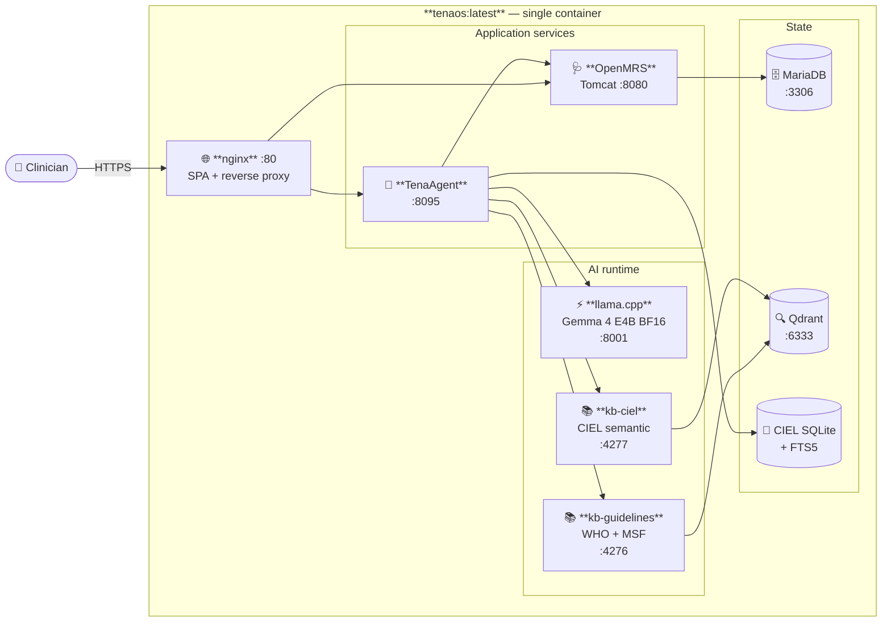

<div align="center">

# TenaOS

**An AI-native clinical operating system for primary-care clinics in low- and middle-income countries.**

[](LICENSE)
[](https://huggingface.co/google/gemma-4-E4B-it)
[](https://openmrs.org/)
[](#five-minute-demo)
[](#scope)

</div>

---

TenaOS pairs the OpenMRS electronic medical record with **TenaAgent** — a
small, agentic AI service powered by Gemma 4 E4B — behind a single-page
clinical workspace. The whole system is one safety boundary:

> **TenaAgent _proposes_. Deterministic middleware _verifies_. Clinicians
> _approve_.**

The agent never writes to OpenMRS directly. Every clinical change is a draft
that a human approves through the UI.

---

## Architecture

TenaOS ships as **one Docker image**. Inside, `supervisord` orchestrates eight
processes on the container's localhost; nothing leaves the container except
through `:80`.



Both knowledge-base daemons load **EmbedGemma 300M** in-process and share a
single Qdrant for hybrid (dense + BM25) retrieval. Bulky artifacts — the GGUF
weights, EmbedGemma checkpoint, and CIEL SQLite — are bind-mounted from the
host so the image stays small.

---

## What TenaAgent does

| Workflow | What it produces |
|---|---|
| **Form Builder** | Natural-language → CIEL-valid OpenMRS forms |
| **Decision Support** | WHO/MSF guideline-grounded recommendations at the encounter |
| **Patient Material** | Plain-language education drafts in the patient's language |
| **Report Builder** | Cohort/count reports from FHIR with citations |
| **SOAP Scribe** | Audio + transcript → structured SOAP note draft |
| **Lab Catalog** | Concept-aware lab search and ordering |
| **Translation** | Across the patient encounter |

Every output is a **draft** until a clinician approves it.

---

## Five-minute demo

**Requirements** — Linux host with an NVIDIA GPU (Ampere or newer), Docker
with `nvidia-container-toolkit`, ~25 GB free disk.

```bash
# 1. Place the model files in ./models/
#    See models/README.md for the conversion command.
ls models/
#  gemma-4-E4B-it-BF16.gguf          (~16 GB)
#  mmproj-gemma-4-E4B-it-bf16.gguf   (~0.5 GB)

# 2. Configure
cp demo.env.example .env
# Edit .env: rotate OPENMRS_*_PASSWORD,
# point TENAOS_EMBED_MODEL_PATH at your EmbedGemma 300M directory,
# point TENAOS_CIEL_SQLITE_PATH at your ciel_search.sqlite3.

# 3. Launch the whole stack — one command.
docker compose up -d

# 4. Open the workspace
open http://localhost:8080
```

A future release will pull all three artifacts from the official TenaOS
HuggingFace organization on first run — see
[`scripts/fetch-models.sh`](scripts/fetch-models.sh).

---

## Models

| Component | Model | License |
|---|---|---|
| Generation | [`google/gemma-4-E4B-it`](https://huggingface.co/google/gemma-4-E4B-it) (BF16 GGUF) | [Gemma Terms of Use](https://ai.google.dev/gemma/terms) |
| Embeddings | [`google/embeddinggemma-300m`](https://huggingface.co/google/embeddinggemma-300m) | Gemma Terms of Use |

We standardize on **BF16 full precision** — no quantization in the production
path. Multimodal audio input rides on Gemma 4's `mmproj` projector through
`llama.cpp`.

---

## Repository layout

```
TenaOS/
├── Dockerfile                    Single all-in-one image
├── docker-compose.yml            One-service compose
├── docker/                       supervisord, nginx, start scripts
├── demo.env.example              Environment template
├── scripts/
│   └── fetch-models.sh           HuggingFace artifact bootstrap
│
├── TenaOS-Frontend/              React + Vite SPA
├── TenaOS-Backend/               OpenMRS Ref-App 3 distribution + Tomcat
├── TenaAgent/                    AI agent service (Python)
│   ├── service/tena_agent_service/
│   ├── manifests/                WHO SMART DAK manifests
│   ├── sources/                  WHO SMART submodules
│   └── evals/                    In-repo eval harnesses
├── TenaOS-LLM/                   llama.cpp CUDA prebuild + Dockerfile
├── TenaOS-KnowledgeBase/         Qdrant + EmbedGemma daemon
├── TenaOS-CIEL/                  CIEL SQLite + FTS5
└── models/                       Bind-mounted GGUF weights (gitignored)
```

Each top-level component has its own `README.md` following the same
**Purpose / Build / Run / Test / Environment** shape.

---

## Why this design

| Decision | Why |
|---|---|
| **One Docker image, not seven** | LMIC operators get a single artifact and a single command. No multi-service orchestration to learn. |
| **`llama.cpp` over vLLM** | Smaller GPU footprint (~15 GB vs ~68 GB for BF16 Gemma 4), native audio multimodal projector, simpler operational story. |
| **BF16 over quantization** | We tested both. BF16 wins on long-context tool-calling reliability with negligible latency overhead on Ampere. |
| **`TenaAgent proposes / middleware verifies / human approves`** | Deterministic verification layer between the model and OpenMRS writes. No clinical action is ever model-only. |
| **OpenMRS Reference Application 3** | The international LMIC EMR standard. Hundreds of clinics already trained on it. |
| **CIEL terminology, not SNOMED** | LMIC-appropriate license, designed for OpenMRS, ships with the WHO SMART concept sets out of the box. |

---

## Status

This is a **research and challenge-submission** codebase. It is the live
software behind [demo.tenaos.com](https://demo.tenaos.com). It is **not**:

- a HIPAA-regulated product,
- a CE-marked or FDA-cleared medical device,
- safety-of-life software.

Operators deploying TenaOS in real clinical settings remain responsible for
local regulatory compliance and clinical risk management. See [`SECURITY.md`](SECURITY.md).

---

## Project docs

| | |
|---|---|
| [CHANGELOG.md](CHANGELOG.md) | Versioning history |
| [CONTRIBUTING.md](CONTRIBUTING.md) | How to contribute |
| [SECURITY.md](SECURITY.md) | Security disclosure policy |
| [CODE_OF_CONDUCT.md](CODE_OF_CONDUCT.md) | Community standards |
| [LICENSE](LICENSE) | Apache 2.0 |

---

## Acknowledgments

TenaOS stands on the shoulders of:

- **[OpenMRS](https://openmrs.org/)** community for the Reference Application 3 distribution.
- **Google** for [Gemma 4](https://ai.google.dev/gemma) and [EmbedGemma](https://huggingface.co/google/embeddinggemma-300m).
- **[Georg Brand & contributors](https://github.com/ggerganov/llama.cpp)** for `llama.cpp`.
- **[Qdrant](https://qdrant.tech/)** for the vector store.
- **[WHO SMART Guidelines](https://www.who.int/teams/digital-health-and-innovation/smart-guidelines)** and **[Médecins Sans Frontières](https://medicalguidelines.msf.org/)** for the clinical knowledge corpora.
- **[CIEL](https://openconceptlab.org/orgs/CIEL)** for the LMIC-appropriate terminology.

---

<div align="center">

**TenaOS** — *primary care, AI-native, where it's needed most.*

</div>
