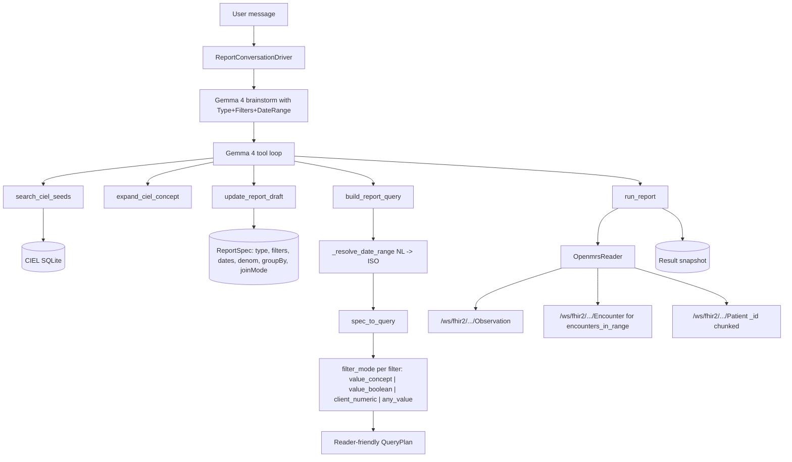

# Gemma 4 Report Builder Demo

This demo shows the symmetric inverse of the Gemma 4 form builder. The form
builder writes CIEL-indexed obs into OpenMRS; the report builder reads them
back using the same CIEL knowledge base.

## Why CIEL closes the loop

Every field built by the form builder lands in OpenMRS as:

```text
obs.concept_id    = <CIEL concept (e.g. 1487 Cough)>
obs.value_*       = <Yes/No (1065/1066) | numeric value | coded answer>
obs.obs_datetime  = <encounter datetime>
obs.person_id     = <patient>
```

The report builder is the read-side agent over the same index. Same CIEL
search tool, same per-question search-and-refine loop, different output:
instead of an OpenMRS `Form` row + `clobdata` JSON schema, it produces a
deterministic FHIR Observation query plan and runs it.

```text
Form builder:   user request -> Gemma plan -> CIEL search -> OpenMRS write
Report builder: user request -> Gemma plan -> CIEL search -> OpenMRS read
```

The CDS service ([cds/service/cds_service/report_conversation.py](service/cds_service/report_conversation.py))
walks the user through naming the report, planning filters, compiling the
query and running it. Every clinician-facing message is a deterministic
footer built from the actual basket + result, NOT from the model's
arithmetic.

## Architecture



## Required services

- CDS service: `http://127.0.0.1:8095`
- Gemma 4 vLLM endpoint: `http://127.0.0.1:8000/v1`
- CIEL SQLite knowledge base: configured by `CDS_CIEL_REPO_ROOT`
- OpenMRS REST: `http://127.0.0.1:18080/openmrs/ws/rest/v1`
- OpenMRS FHIR2: `http://127.0.0.1:18080/openmrs/ws/fhir2/R4`

Health check:

```bash
curl http://127.0.0.1:8095/health
```

`ciel.available=true` and `vllm.healthy=true` are both required.

## Step 1 — seed synthetic obs

Reports only cover data captured through the CIEL-backed forms. On a fresh
install there is no obs data yet; the seed script creates 24 synthetic
patients and a TB-like obs profile across whichever CIEL concepts the
published forms reference.

```bash
OPENMRS_USERNAME=admin OPENMRS_PASSWORD=Admin123 \
    python3 cds/scripts/seed_demo_obs.py
```

Expected output:

```text
[seed] Discovered 11 CIEL concepts across published forms.
[seed] Seeded 24 patients, ~70 encounters, ~300 obs across 11 CIEL concepts.
```

Reproducible weighted distribution (PRNG seed `42`):

| Concept | Distribution |
|---|---|
| Cough variants | ~60% Yes |
| Weight loss | ~40% Yes |
| Fever | ~30% Yes |
| Night sweats | ~25% Yes |
| HIV status (Coded) | 65% Negative / 20% Positive / 15% Unknown |
| Numeric obs | uniform within the CIEL `extras.low_absolute` / `hi_absolute` range |

Synthetic patients are tagged `SYN-DEMO-NNN`. Wipe between runs with:

```bash
python3 cds/scripts/seed_demo_obs.py --wipe
```

## Step 2 — demo scenarios

Open `http://<host>/reports/new` and run the four canonical scenarios.
Click **Show reasoning** to expose the tool trace.

### Scenario 1 — count (single Boolean filter)

> *"How many patients had cough in the last quarter?"*

Demonstrates the `value_boolean` filter mode. OpenMRS FHIR2 stores CIEL
Boolean obs as `valueBoolean: true|false`; the reader fetches the
Observation set for the code and applies the predicate client-side.
Expected result tile: ~13–16 patients (weighted distribution, varies with
synthetic seed).

### Scenario 2 — cohort (AND join across two Booleans)

> *"Show me all patients with cough AND weight loss in the last 6 months."*

Demonstrates filter intersection in middleware. The patient table populates
with `display_name`, `gender`, and `birthdate` resolved via a single
`Patient?_id=` batch (chunk size 50). Expected result: ~6 patients (the
synthetic profile concentrates this combination in ~25% of the cohort).

### Scenario 3 — indicator (numerator/denominator/rate)

> *"TB screening rate among patients seen this year."*

Demonstrates the `encounters_in_range` denominator path. The numerator is
a CIEL filter (`Cough present` or another TB indicator); the denominator
is distinct subjects across all encounters in the range, pulled from
`/ws/fhir2/.../Encounter` (O(encounters), not O(all obs)). Result tile:
three sub-tiles (numerator / denominator / rate%).

### Scenario 4 — pivot (sex x age_group)

> *"TB cases by sex and age group last 12 months."*

Demonstrates the demographics path: matched patient ids -> chunked
`Patient?_id=` batches -> bucketing into `Female|Male|Other` x
`<5|5-14|15-24|25-49|50+`. Result panel renders a grid; the seed script's
12F/12M distribution across age buckets keeps every cell populated.

### Scenario 5 — nested logic warning (failure-mode demo)

> *"(cough AND weight loss) OR fever"*

The deterministic footer surfaces a warning:

> *Note: I can only apply a single join mode (AND or OR) per report in v1; nested boolean logic like '(A AND B) OR C' is not yet supported. The result reflects the chosen join mode applied flat across all filters.*

This is intentional — v1 is documented as flat join_mode. The agent still
produces a meaningful (broader) result rather than refusing.

## Filter mode safety

Every filter in the compiled query carries an explicit `filter_mode`
chosen by the CIEL bundle's datatype, not by the agent. This protects
against the single biggest landmine in OpenMRS FHIR2 reporting:

| CIEL datatype | filter_mode | How the reader evaluates it |
|---|---|---|
| `Boolean` | `value_boolean` | Fetch Observation by code, filter `valueBoolean == filter.value_bool` in middleware. **Never uses `value-concept=`** — Booleans aren't stored as coded answers. |
| `Coded` (with answers) | `value_concept` | Server-side `value-concept=` filter. Probed once per session; falls back to client-side `valueCodeableConcept.coding[].code` filtering on servers that reject the parameter. |
| `Numeric` | `client_numeric` | Fetch by code, filter `valueQuantity.value` against operator + threshold in middleware. `value-quantity=` is unreliable across OpenMRS builds. |
| `N/A` + clinical class (Diagnosis/Symptom/Finding/Procedure/Test/Question) | `value_concept` | Same as Coded; the form renderer paired these concepts with Yes/No (1065/1066) answers when the encounter was filled. |
| Any | `any_value` | No value predicate; collect distinct subjects (used by indicator denominators). |

## Smoke-test results against the live stack

End-to-end runs against OpenMRS + Gemma 4 E4B with the seeded synthetic
dataset (24 patients, 70 encounters, 432 obs across 60 CIEL concepts):

| Scenario | Filters | Status | Result |
|---|---|---|---|
| Count: cough in last 12 months | 1 | ready | total = 2 |
| Cohort: cough AND weight loss, last 12 months | 2 | ready | 1 patient |
| Indicator: TB screening rate this year | 3 | draft (Gemma forgot `set_denominator` + `run_report`) | — |
| Pivot: TB cases by sex × age group | 1 | ready but type stayed `count` | grid empty |

Count + cohort are clean end-to-end. Indicator and pivot reveal a
prompt-refinement gap: the model adds filters but doesn't always call
`set_denominator` / `set_report_type` / `add_group_by` before
`build_report_query`. The data plane and tool loop work; the agent system
prompt at [report_conversation.py](service/cds_service/report_conversation.py)
needs a per-type "Step 4" sequencing nudge (mirror of the form-builder's
small-basket nudge) to consistently produce the indicator + pivot shapes.
Track this as the first follow-up iteration.

## v1 limitations (documented for the demo)

- Reports only cover obs captured through the CIEL-backed forms in this
  system. Historical OpenMRS data entered via other means may have
  different or missing concept ids.
- A single global `join_mode` (AND or OR) per report; nested boolean
  logic like `(A AND B) OR C` must be split into multiple reports.
- Aggregate counts + cohort lists; longitudinal time-series (CD4 trend
  over 12 months) is Phase 2.
- Pivot supports up to 2 dimensions; concept_id as a pivot dimension is
  reserved for Phase 2 (it requires per-patient value lookup inside the
  date range).
- Default cohort cap: 500 patients per report (300-row patient_demographics
  chunk × pagination cap).

## Visualization templates

Phase 1 graph support is deterministic and report-type scoped. Gemma can ask
for a visualization through `set_visualization`, but the compiler normalizes
the request before results are stored. Chart values are derived from the
authoritative `last_result` payload, not from model text.

Supported templates:

| Report type | Templates |
|---|---|
| Count / cohort | `filter_bar` |
| Indicator | `indicator_rate`, `filter_bar` |
| Pivot | `pivot_grouped_bar`, `pivot_stacked_bar`, `pivot_heatmap` |

Phase 2 should add new backend aggregations rather than stretching these
templates beyond their data shape:

- `time_series`: bucket observation or encounter matches by week, month,
  quarter, or year. This needs per-bucket patient-id sets and explicit
  denominator handling for rates over time.
- `numeric_distribution`: summarize numeric obs with validated bins,
  threshold bands, and optional min/median/max. This needs observation-value
  reads, not just distinct patient ids.
- `row_per_encounter`: return encounter-level rows for exports and audit-style
  reports. This should be modeled separately from patient cohort reports so
  pagination, caps, and PHI display rules are explicit.

## Trust boundary

Gemma 4 never produces a FHIR URL or SQL. Every `run_report` call goes
through `build_report_query` first; the compiler:

- rejects any CIEL conceptId not present in the local CIEL SQLite store
- rejects a filter whose `filter_mode` doesn't match the CIEL datatype
- rejects an indicator with no denominator (or denominator kind
  `all_patients_in_range`, which would force a full Observation scan)
- rejects a pivot with no `group_by` dimension
- rejects duplicate filters (same concept + value + operator combination)

These mirror the form-builder's safety layer (`_is_usable_form_bundle`,
the QA-display-name filter, cross-section concept dedupe). The same per-turn
search-phrase repeat guard is in place — the model cannot loop on a failed
phrase; it must use the refinement vocabulary (synonym, generalize, CIEL
prefix, presence, history).
