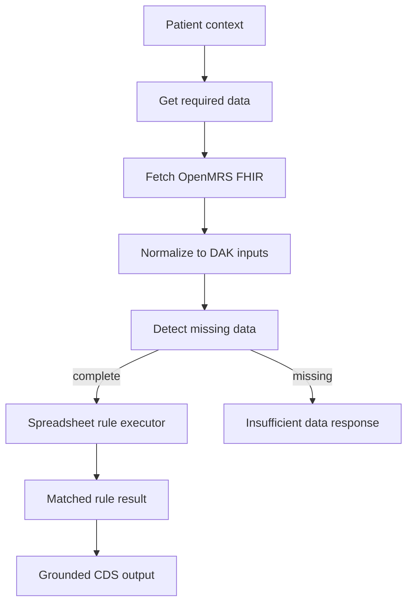

# SMART DAK TB Execution Map

Date: 2026-05-10

## Current Executable Status

The imported TB DAK does not currently provide executable CQL, PlanDefinition, FHIR Library, packaged definitions, or test cases in the GitHub clone. The published package endpoint is unavailable. Execution must therefore start from the published spreadsheets:

- Decision logic: `/var/www/tenaos/cds/sources/smart-dak-tb-downloads/TB DAK_decision-support logic.xlsx`
- Data dictionary: `/var/www/tenaos/cds/sources/smart-dak-tb-downloads/TB DAK_core data dictionary.xlsx`

## Execution Strategy

Use a deterministic spreadsheet rule executor first. Generate CQL/PlanDefinitions later after the rule executor proves the semantics.



## Phase 1 Rule Scope

Start with `TB.B4.DT`.

| Field | Value |
|---|---|
| Decision ID | `TB.B4.DT` |
| Sheet | `TB.B4.DT Screening algorithm` |
| Trigger | `TB.B4. Determine the screening algorithm` |
| Hit policy | Rule order |
| Approximate rule rows | 4 |
| Inputs | Risk group, Age |
| Outputs | Output type, Action, Guidance, Annotations, References |
| Why first | Small, low complexity, good test of tool routing and missing-data handling |

## Patient Input Requirements by Decision Cluster

### Screening

| Decision | Required input families |
|---|---|
| `TB.B4.DT` | Risk group, age |
| `TB.B7.DT` | Screening algorithm, symptom result, CXR result, mWRD result, inpatient HIV status, TB prevalence, CRP |

Likely OpenMRS/FHIR sources:

- Age: `Patient.birthDate`
- Risk group: local TB risk group observations/program data
- Symptom screening result: `Observation`
- CXR result: `Observation` or `DiagnosticReport`
- mWRD result: `Observation` or `DiagnosticReport`
- Inpatient with HIV: encounter setting plus HIV condition/status
- TB prevalence: site configuration, not patient record
- CRP: `Observation`

### TPT

| Decision | Required input families |
|---|---|
| `TB.E3.1.DT` | Risk group, age |
| `TB.E4.7.DT` | TB screening result, TB diagnosis result, risk group, TB infection test performed/result, age, index-case resistance, TB drug contraindications |
| `TB.E6.DT` | Index-case resistance, TB drug contraindications, age |
| `TB.E8.DT` | TPT regimen, age, body weight, interacting medications, risk group |

Likely OpenMRS/FHIR sources:

- Diagnosis and screening results: `Observation`, `Condition`
- Infection test performed/result: `Observation` or `DiagnosticReport`
- Index-case resistance: contact investigation data or local observation
- Contraindications: `AllergyIntolerance`, `Observation`
- Weight: `Observation` with unit validation
- Interacting medications: `MedicationRequest` or `MedicationStatement`

### Diagnosis

| Decision | Required input families |
|---|---|
| `TB.C7.DT` | HIV status, inpatient HIV, symptoms, advanced HIV disease, seriously ill, CD4, HIV stage |
| `TB.C12.DT` | Diagnostic category, symptoms, LF-LAM, mWRD, microscopy, culture, HIV/severity facts |
| `TB.C16.1.DT` | mWRD/RIF results, diagnostic tool, MDR risk, symptoms, HIV, age, comorbidities, prior treatment |
| `TB.C16.4.DT` | First and second mWRD/RIF results, MDR risk |
| `TB.C20.DT` | RIF, INH, FQ, BDQ, LZD susceptibility |
| `TB.C24.DT` | Symptoms, danger signs, age, test performed, diagnosis method, risk group, nutrition, TB contact, score |

Likely OpenMRS/FHIR sources:

- HIV and advanced disease facts: `Condition`, `Observation`
- CD4 and lab results: `Observation`
- TB test results: `Observation`/`DiagnosticReport`
- Drug susceptibility: `Observation`
- Prior TB treatment: `Condition`, `MedicationStatement`, program history, or observation
- Pediatric nutrition/contact scoring: local observations and calculated middleware fields

### Treatment

| Decision | Required input families |
|---|---|
| `TB.D9.DT` | Regimen type, INH, age, site/severity, weight, HIV, CD4, nutrition, sex |
| `TB.D10.DT` | Regimen type, age, FQ, DR-TB eligibility, disease site, pregnancy, breastfeeding, contraception, severity |
| `TB.D11.DT` | TB treatment regimen, weight, regimen composition, age |

Likely OpenMRS/FHIR sources:

- Regimen type/composition: deterministic output from prior DAK rule or current order context
- Susceptibility results: `Observation`
- Site/severity: `Condition` and observations
- Pregnancy/breastfeeding/contraception: `Observation`
- Weight: `Observation`
- Sex: `Patient.gender` plus local sex-at-birth policy if needed

## Deterministic Rule Executor Contract

The first executor does not need to know medicine. It needs to evaluate structured table rows exactly.

Required behavior:

- Load workbook and target sheet by decision ID.
- Read metadata rows for decision ID, business rule, trigger, and hit policy.
- Read input columns and output columns.
- Normalize patient inputs to table vocabulary.
- Evaluate each row according to hit policy:
  - `Rule order`: return matching rows in row order or the first applicable action if configured for the specific table.
  - `First`: return first matching row.
- Return no recommendation if required inputs are missing.
- Return matched row number(s), input values used, output type, action, guidance, annotations, and references.

## Trace Format

Every deterministic result should include:

```json
{
  "dak": "smart-dak-tb",
  "sourceVersion": "1.0.2-ci-build",
  "decisionId": "TB.B4.DT",
  "sourceSheet": "TB.B4.DT Screening algorithm",
  "hitPolicy": "Rule order",
  "inputFactsUsed": [],
  "missingFacts": [],
  "matchedRows": [],
  "result": {
    "outputType": null,
    "action": null,
    "guidance": null,
    "annotations": null,
    "references": []
  }
}
```

## Gemma 4 Boundary

Gemma may choose:

- Which decision ID to inspect.
- Which required-data tool to call.
- Whether the middleware reports enough data to execute.
- How to phrase final CDS from the deterministic result.

Gemma may not choose:

- The matched rule row.
- The regimen, dosage, diagnosis, eligibility, or screening outcome.
- Any missing value.
- Any local configuration value.

## Next Implementation Target

Implement a read-only parser for `TB.B4.DT` only, using synthetic patient inputs:

- Adult household contact.
- Child contact.
- Missing risk group.
- Missing date of birth/age.

The parser should return structured traces before any Gemma prompt or final CDS card is introduced.
