# TenaOS Architecture Diagrams

This file keeps the Mermaid source for the technical report diagrams. The diagrams are intentionally small and implementation-backed so they can render cleanly on GitHub and the website.

## System Context

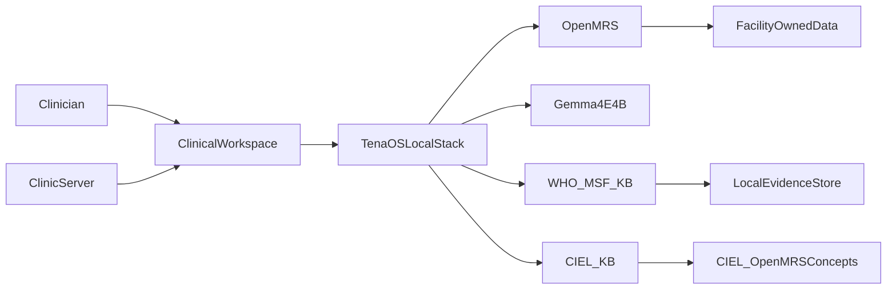

## Single-Container Runtime

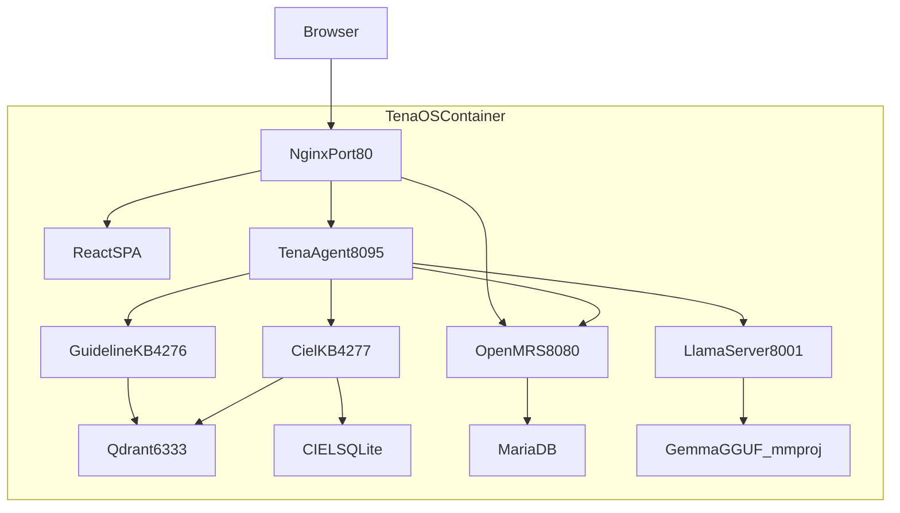

## AI Safety Boundary

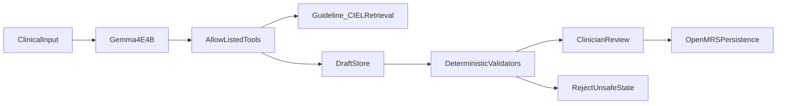

## WHO/MSF KB Build

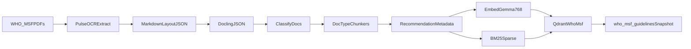

## WHO/MSF Runtime Retrieval

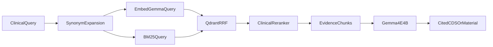

## CIEL KB Build

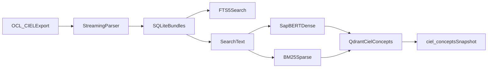

## CIEL Runtime Resolution

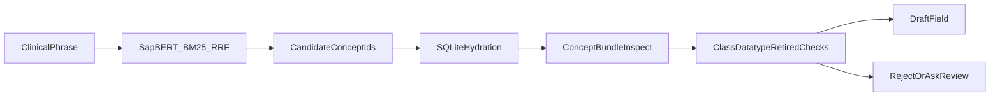

## Form Builder Workflow

```mermaid
flowchart LR
  Request[FormRequest] --> Research[WHO_MSFResearch]
  Research --> Worklist[QuestionWorklist]
  Worklist --> Resolve[CIELResolution]
  Resolve --> Basket[DraftBasket]
  Basket --> Repair[CoverageRepair]
  Repair --> Schema[OpenMRSSchemaBuild]
  Schema --> Review[ClinicianReview]
  Review --> Publish[OpenMRSPublish]
```

## Scribe Workflow

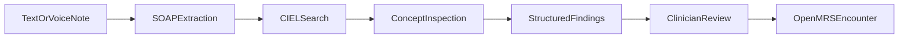

## CDS Workflow

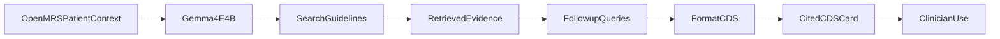

## Patient Education Workflow

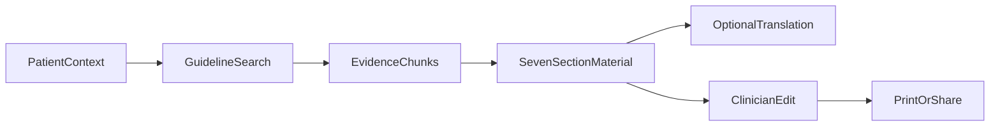

## Report Builder Workflow

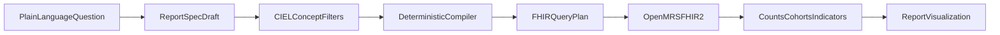

## GEPA Optimization Loop

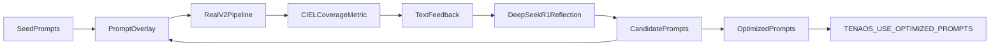

## LoRA Data Path

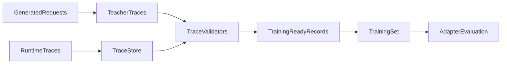
