# TenaOS Technical Report

**TenaOS is a local-first clinical AI operating system for primary-care clinics, built on OpenMRS, powered by Gemma 4 E4B, and designed around a simple safety invariant: Gemma proposes, middleware verifies, clinicians approve, and OpenMRS persists.**

This report is the complete technical system document for TenaOS. It focuses on the real engineering arc in the codebase: GEPA-optimized Gemma 4 E4B agent behavior first, followed by a LoRA/SFT data path for deeper adaptation once the workflows and trace quality are stable.

## Abstract

TenaOS is a local-first clinical AI operating system that lets primary-care clinics build and operate standards-based digital health workflows through natural language. It combines OpenMRS, Gemma 4 E4B, a WHO/MSF guideline knowledge base, a CIEL terminology knowledge base, deterministic middleware, and clinician review inside a locally deployable stack.

The problem TenaOS addresses is implementation failure. Clinics need forms, terminology mappings, reporting logic, guideline support, and localized patient communication, but the expertise to configure those systems is usually external, expensive, and temporary. TenaOS turns that implementation work into a local, auditable, clinician-reviewed agent workflow.

The system runs as a single local container with OpenMRS, MariaDB, Qdrant, Gemma 4 E4B served through `llama.cpp`, and the TenaAgent orchestration service. TenaAgent implements form building, scribing, evidence-grounded clinical decision support, patient education, reporting, and lab lookup. The model never writes directly to OpenMRS. It operates through allow-listed tools and structured draft stores; final writes go through deterministic validation and clinician approval.

Measured implementation artifacts include a local CIEL SQLite store with 58,687 concepts and 298,905 mappings, a WHO/MSF guideline index with 69,476 chunks, Qdrant snapshots for both guideline and CIEL retrieval, and a LoRA/SFT corpus with 16,005 validated task-tagged traces split into 18,909 training, 1,071 validation, and 1,109 held-out test conversations. Internal technical form-builder evaluation completed 147/147 prompts with 0 failures, 0.465 mean concept-cluster recall, 0.993 schema-valid rate, and 17.97 s median latency.

## Contributions

TenaOS makes four technical contributions.

1. **A local-first clinical AI runtime.** TenaOS packages OpenMRS, Gemma 4 E4B, local guideline retrieval, local terminology retrieval, and TenaAgent into a single deployable stack.

2. **Two complementary local knowledge bases.** The WHO/MSF knowledge base grounds recommendations and patient materials in guideline evidence; the CIEL knowledge base resolves natural language to standards-based OpenMRS concepts.

3. **A constrained clinical agent pattern.** Gemma 4 E4B interacts through allow-listed tools, retrieval services, draft stores, deterministic validators, and OpenMRS writers instead of uncontrolled free-text actions. The architecture treats the model as a planner and proposer, while concept validation, schema construction, query compilation, and persistence stay deterministic.

4. **A GEPA-first adaptation path.** The central adaptation claim is that many clinical agent failures are instruction and tool-use failures before they are weight failures. TenaOS therefore optimizes prompts against the real production pipeline with GEPA before training LoRA adapters on validated traces.

## Naming and Model Scope

This report uses **TenaOS** as the canonical product name. The technical artifacts, code paths, and diagrams in this report use TenaOS consistently.

All runtime code, artifacts, and evaluation results in this report refer to Gemma 4 E4B BF16 GGUF served via `llama.cpp`, with the Gemma multimodal projector for audio input.

## Design Requirements

TenaOS targets clinics that cannot assume continuous internet, cloud inference, or a local implementation team. The system is built around these requirements:

- **Local ownership:** patient data and model inference stay on facility-owned infrastructure.
- **Standards compatibility:** OpenMRS remains the record system; CIEL and FHIR-style query plans preserve interoperability.
- **Clinical review:** every AI-generated clinical artifact remains reviewable and editable by a clinician.
- **Deterministic trust boundary:** middleware validates concept IDs, datatypes, retired status, schema structure, reporting plans, and OpenMRS writes.
- **Evidence grounding:** CDS and patient education search local WHO/MSF evidence rather than answering from model memory.
- **Auditability:** tool calls, retrieval steps, drafts, and final outputs are persisted or streamed as traces.

## System Overview

At a high level, TenaOS converts natural clinical language into standards-based clinical artifacts.

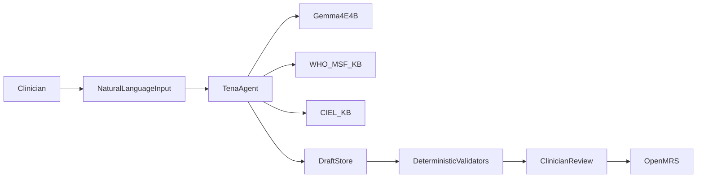

The deployed runtime is a single-container stack. nginx is the only public ingress. TenaAgent, OpenMRS, Qdrant, Gemma, and both KB daemons communicate on container-local ports.

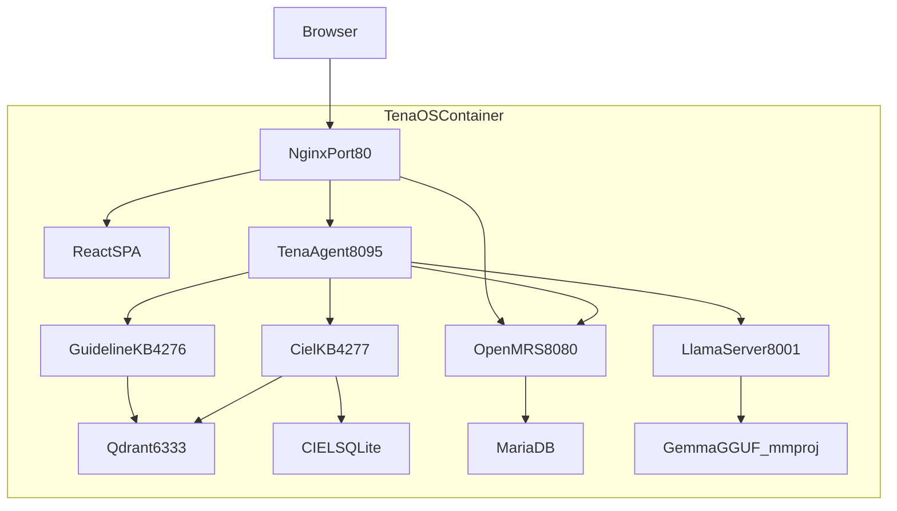

The main source-backed components are:

- `TenaOS-Frontend/`: React clinical workspace.
- `TenaOS-Backend/`: OpenMRS Reference Application 3 packaging and metadata contracts.
- `TenaAgent/`: Python orchestration service for all LLM-mediated workflows.
- `TenaOS-LLM/`: `llama.cpp` serving layout for Gemma 4 E4B BF16 GGUF and multimodal projector.
- `TenaOS-KnowledgeBase/`: Qdrant-backed retrieval daemon for WHO/MSF guidelines and CIEL semantic search.
- `TenaOS-CIEL/`: CIEL SQLite, FTS5 search, bundle expansion, and Qdrant indexing code.
- `scripts/fetch-models.sh`: artifact bootstrap for Gemma, EmbedGemma, CIEL SQLite, Qdrant snapshots, and SapBERT.
- `docker/restore-qdrant.sh`: supervised restore of the `who_msf_guidelines` and `ciel_concepts` snapshots.

## Knowledge Systems

TenaOS has two local knowledge systems because clinical evidence and clinical terminology serve different roles.

The WHO/MSF guideline KB answers: “What does the evidence or protocol say?” It supports CDS, patient education, and form design.

The CIEL KB answers: “Which standard concept should represent this clinical idea in OpenMRS?” It supports forms, scribing, reports, and safe persistence.

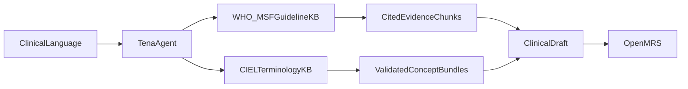

## WHO/MSF Guideline Knowledge Base

### Source and Extraction

The WHO/MSF KB is composed of WHO and MSF clinical guidance documents, including clinical practice guidelines, pocket guides, technical reports, rapid advice, consolidated guidance, and MSF protocol-style material. The offline build pipeline lives in `/var/www/TenaOS_DeepSeek/kb-pipeline`.

The extraction begins with Pulse OCR. `source/pulse_extract.py` uploads PDFs to the Pulse `/extract` API in asynchronous mode and stores a normalized JSON result for each document. Each result preserves:

- extracted markdown,
- page count,
- Pulse extraction ID,
- bounding boxes with page numbers and confidence,
- warnings,
- optional footnote references,
- large-document S3 result handling,
- resume metadata,
- a page-budget tracker.

The Pulse extraction script tracks a 19,900-page extraction budget. The current build tree contains 401 chunk JSONL files and 69,476 guideline chunks.

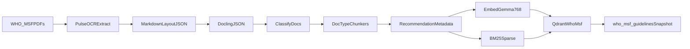

### Normalization and Chunking

The build pipeline then converts cleaned markdown into Docling JSON with `convert_md.py`, classifies documents, fixes heading levels, chunks documents, enriches metadata, post-processes chunks, and backfills metadata. `build_kb_guidelines.sh` orchestrates that seven-stage build.

Chunking is document-type aware. The pipeline has chunkers for clinical practice guidelines, pocket guides, technical reports, rapid advice, consolidated guidelines, and MSF protocols. Shared chunking logic in `source/chunkers/common.py` identifies recommendation signals such as “WHO recommends,” “It is recommended that,” “Good practice statement,” and GRADE certainty symbols. It classifies content into types such as:

- `recommendation`,
- `implementation`,
- `etd`,
- `methods_pico`,
- `background`,
- `research_gap`,
- `annex`,
- `scope`.

Each chunk stores heading paths, provenance, source URL, document type, disease area, content hash, version date, token count, recommendation number, and retrieval priority. Current or actionable chunks receive higher retrieval priority; superseded chunks can be hard-dropped with retrieval priority `0.0`.

### Enrichment

The enrichment stage assigns clinically useful metadata:

- recommendation strength,
- evidence certainty,
- good-practice-statement flags,
- recommendation version dates,
- GRADE evidence-profile data,
- WHO MEC table data where applicable,
- module and disease-area metadata.

This metadata is not decorative. It is used at retrieval time to boost recommendation and implementation chunks over background text.

### Embedding and Indexing

`embed_chunks_gpu.py` embeds contextualized chunks with EmbedGemma 300M. The input text is the heading path plus chunk body. The embedding dimension is 768. Long chunks are split into up to three 10,000-character windows, embedded independently, mean-pooled, and normalized. The GPU build script uses bfloat16 model execution and writes `embeddings.npy` plus `chunk_ids.json`.

`build_qdrant.py` aligns chunk IDs with embeddings, cleans OCR artifacts, filters low-quality or duplicate snippets, computes BM25 sparse vectors, and writes Qdrant points with:

- dense vector `embedgemma`,
- sparse vector `bm25`,
- payload indexes for document and clinical metadata,
- point IDs derived from stable UUID5 chunk IDs.

The resulting `who_msf_guidelines.snapshot` is about 448.8 MB in the local artifact set.

### Runtime Retrieval

The runtime daemon in `TenaOS-KnowledgeBase/kb_guidelines/daemon.py` exposes `/health`, `/stats`, and `/search`. It binds locally by default and can require an `X-TenaOS-KB-Secret` shared secret.

Runtime retrieval uses `KBRetriever` and `QdrantHybridRetriever`:

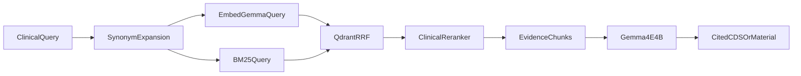

Search modes are:

- `lex`: BM25 sparse search,
- `sem`: EmbedGemma dense search,
- `rrf`: reciprocal-rank fusion of dense and sparse prefetches.

The reranker performs clinical post-processing: corruption filtering, synonym expansion, action-query detection, content-type boosts, actionability boosts for dose/route/frequency text, domain coherence penalties, source diversity penalties, condition/title exclusions, population/intent reranking, and low-confidence flags.

## CIEL Terminology Knowledge Base

### Source and SQLite Build

CIEL is the terminology layer that makes TenaOS interoperable with OpenMRS. The local SQLite store is built from an OpenConceptLab CIEL export. The checked local artifact is CIEL `v2026-03-23`.

`TenaOS-CIEL/ciel_search/pipeline.py` streams the export with `ijson` and writes:

- `source_metadata`,
- `concept_bundles`,
- `concept_mappings`,
- `concept_search_fts` FTS5 index.

The measured SQLite artifact contains:

- 58,687 concepts,
- 3,205 retired concepts,
- 298,905 mappings,
- 8,545 Q-and-A edges,
- 3,259 concept-set edges,
- 58,687 concept bundles with search text.

Each concept bundle preserves the raw concept JSON and stores UUID, display name, class, datatype, retired status, locales, names, descriptions, answers, set members, external mappings, incoming relationships, source version, and generated search text.

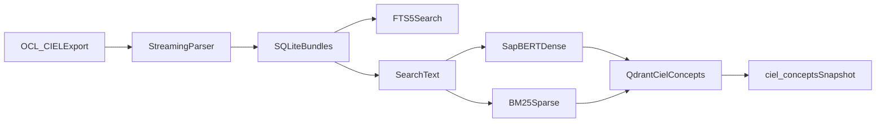

### Search Text and Bundle Expansion

Search text is built from preferred names, synonyms, descriptions, answer labels, set-member labels, external source codes, and relationship labels. This matters because clinicians rarely use exact CIEL labels. A query like “BP,” “blood pressure,” or “systolic” must still recover usable OpenMRS concepts.

SQLite remains the authority for deterministic lookups and bundle expansion. It supports exact search, FTS5 fallback, Q-and-A answer expansion, concept-set member expansion, and form-ready seed discovery.

### Semantic Index

The semantic index uses SapBERT (`cambridgeltl/SapBERT-from-PubMedBERT-fulltext`) for dense concept embeddings and the shared BM25 encoder for sparse vectors. `ciel_search/qdrant_index.py` writes the Qdrant collection `ciel_concepts` with:

- dense vector `sapbert`,
- sparse vector `bm25`,
- payload fields for concept ID, UUID, display name, class, datatype, retired status, locales, set status, external mapping sources, and source version.

The local `ciel_concepts.snapshot` is about 326.3 MB.

### Runtime Resolution

Runtime CIEL discovery is hybrid. `kb_guidelines/ciel_retriever.py` queries Qdrant with SapBERT and BM25 RRF, returns candidate concept IDs, and hydrates those IDs from SQLite through `CielSearchService`.

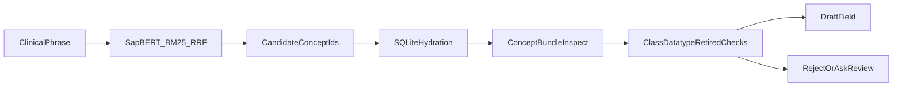

The runtime never trusts vector search alone. Final decisions use hydrated concept bundles and middleware checks: class, datatype, retired status, duplicate concepts, answer availability, set membership, and OpenMRS UUID compatibility.

## Feature Architecture

### Natural-Language Form Builder

The form builder is the most mature workflow and the primary GEPA optimization target. The production pipeline is implemented in `TenaAgent/service/tena_agent_service/form_pipeline/runner.py`:

1. Research the request against the WHO/MSF KB.
2. Produce a structured question worklist.
3. Resolve worklist items against CIEL.
4. Commit fields into a draft basket.
5. Run a bounded coverage-repair pass.
6. Build an OpenMRS schema.
7. Produce a deterministic summary for clinician review.
8. Publish only after approval.

OpenMRS form publication is handled by `openmrs_writer.py`. Publishing is a three-step REST operation: create Form metadata, upload the JSON schema as ClobData, and bind the schema as a form resource. If a later step fails, the created form is retired so only usable forms appear in the form list.

### SOAP Scribe

The scribe accepts text or voice. Text and trace routes are implemented in `routes/scribe_routes.py`; the tool loop is in `scribe_tool_loop.py`.

For voice input, the route accepts multipart audio, converts it to 16 kHz mono WAV with `ffmpeg`, base64-encodes it, and sends it to Gemma using an audio content block. For Amharic text, the route can translate the note to English before SOAP extraction.

The scribe workflow is:

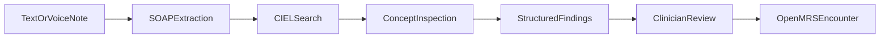

The model extracts SOAP sections, coded concepts, observations, and medications. The backend validates and resolves CIEL IDs before review. Unresolved items are carried forward for clinician review rather than silently written.

### Clinical Decision Support

CDS is implemented as an agentic KB loop in `tool_loop.py`. Gemma has two tools:

- `search_guidelines`: query the local WHO/MSF guideline KB.
- `format_cds_result`: emit the final structured CDS card.

The loop encourages multiple searches: main condition, treatment, dosing, contraindications, monitoring, and referral. Search results are returned as tool observations so Gemma can issue follow-up queries.

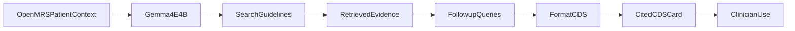

The safety posture is retrieval-grounded, clinician-reviewed decision support. Unsupported recommendations are blocked by retrieval grounding, abstention behavior, and clinician review.

### Patient Education

Patient education uses the same evidence-grounded pattern as CDS but with different output goals. `material_loop.py` asks Gemma to gather guideline evidence and produce a seven-section patient-facing document:

- what you have,
- why it matters,
- what to do,
- your medications,
- what to avoid,
- follow-up schedule,
- when to seek help.

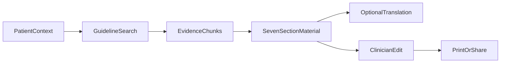

The difference from CDS is audience and tone. CDS speaks to clinicians; patient education translates the same evidence-grounded approach into actionable language for patients.

### Plain-Language Reporting

The report builder is intentionally split between model planning and deterministic execution. The model mutates a small `ReportSpec`; `report_builder.py` compiles that spec into a `QueryPlan`. The agent never emits raw FHIR URLs.

The compiler:

1. resolves natural-language date phrases,
2. validates all CIEL concepts locally,
3. chooses filter modes from CIEL datatypes,
4. emits one or more FHIR Observation/Patient/Encounter search descriptors,
5. defines post-processing such as intersect, union, divide, or group-by.

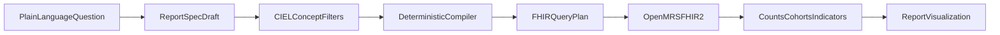

`openmrs_reader.py` performs the FHIR2 reads and datatype-specific filtering. Boolean observations are filtered client-side by `valueBoolean`, coded observations use `value-concept` with fallback, and numeric observations are filtered client-side because `value-quantity` is unreliable across OpenMRS FHIR2 builds.

## GEPA Optimization

TenaOS uses GEPA as the first adaptation layer because many failures in clinical-informatics agents are instruction and tool-use failures, not missing model weights. GEPA can optimize the prompts that tell Gemma how to search, inspect, reject, and commit concepts before any LoRA training is attempted.

The GEPA runner is offline. `scripts/optimization/run_form_gepa.py` configures:

- task model: local Gemma 4 E4B endpoint,
- reflection model: DeepSeek-R1 on Vertex,
- dataset: clinician-graded form prompts with `requireAnyOf` concept clusters,
- metric: deterministic CIEL-expanded coverage plus schema validity and size constraints.

The crucial implementation detail is train-equals-serve. `form_pipeline_dspy.py` does not build a toy surrogate program. It wraps the real `run_form_pipeline_agent` and uses `prompt_overlay()` to evaluate candidate prompts inside the actual production pipeline.

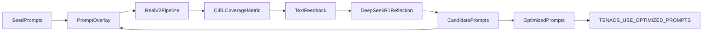

The optimized prompts are exported into `prompts/optimized/`. Runtime activation is explicit through `TENAOS_USE_OPTIMIZED_PROMPTS=1`. Base prompts remain SHA-256 hash pinned, so unintentional prompt drift is caught.

The GEPA score is normalized to a 0 to 1 range. A score of 1.0 means full CIEL-expanded cluster coverage with a valid schema and acceptable field count. The reported 0.246 form score comes from a small CIEL-focused optimization subset where the goal was to improve concept selection behavior under difficult terminology conditions. The broader 147-prompt form-builder baseline is reported separately as the system-level form evaluation. Because this is a CIEL-focused calibration subset, the score is best read as evidence for the optimization loop under difficult terminology conditions rather than as a broad product-quality score.

Internal technical evaluation metrics:

- Baseline form-builder eval: 147/147 completed prompts, 0 failures, mean recall 0.465, schema-valid rate 0.993, median latency 17.97 s.
- Historical form CIEL GEPA run: best validation score 0.246 on a small dev subset.
- Historical report GEPA run: best validation score 0.492 on a small report GEPA subset.

These are reported as completed internal technical evaluation results for the submitted system.

## LoRA Fine-Tuning

TenaOS ships a single task-tagged LoRA adapter that serves every workflow. Rather than maintaining one model per feature, the adapter is trained multi-task over clinical-informatics behaviours and routed at inference by task tags such as `[form]`, `[report]`, `[scribe]`, `[scribe-am]`, `[cds]`, and `[edu]`.

The sibling `/var/www/LORA_TenaOS` repository generates, validates, normalizes, and trains the adapter corpus:

- 16,005 validated task-tagged traces,
- 18,909 training conversations,
- 1,071 validation conversations,
- 1,109 held-out test conversations.

The form trace schema teaches assistant-side behavior: understanding requests, planning evidence search, searching WHO/MSF evidence, selecting CIEL concepts, building a final form, and marking quality. Validation rejects PHI-like samples, invalid schema states, retired concepts, wrong datatypes, duplicate CIEL codes, unsupported concepts, unresolved items, and records outside the training-readiness criteria.

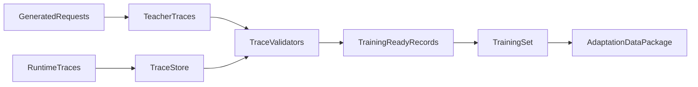

The adapter was trained as a BF16 LoRA over the text decoder. Records are real multi-turn ShareGPT-style conversations reconstructed from production event traces where available, and training masks loss to assistant turns only.

Training used rank 16, alpha 32, dropout 0.0, maximum sequence length 24,576, batch size 1 with 8-step gradient accumulation, and 3 epochs. Runtime was 70.5 hours on an A100 80GB, and the final recorded train loss was 0.04123. Workflow-level LoRA performance claims require a separate full-runtime evaluation.

## Evaluation Methodology

The evaluation protocol is detailed in `docs/evaluation/evaluation-protocol.md`. The core principle is to separate technical evaluation from clinical validation.

The completed technical evaluation package is summarized below.

| Workflow | Key metrics | Completed evidence in this report |
| --- | --- | --- |
| Form builder and GEPA | CIEL-expanded recall, exact recall, schema-valid rate, size-ok rate, hallucinated-code rate, retired-code rate, tool calls, latency, publish readiness | 147/147 form prompts completed, 0 failures, 0.465 mean concept-cluster recall, 0.993 schema-valid rate, 17.97 s median latency |
| WHO/MSF retrieval | Retrieval scale, local indexing, hybrid retrieval, reranker design, citation grounding | 69,476 guideline chunks indexed with EmbedGemma dense vectors and BM25 sparse vectors; 448.8 MB local Qdrant snapshot |
| CIEL retrieval and validation | Concept coverage, mapping coverage, retired concept handling, bundle hydration, OpenMRS concept identity | 58,687 concepts, 298,905 mappings, 8,545 Q-and-A edges, 3,259 concept-set edges, 58,687 hydrated bundles |
| Scribe | Text and voice input path, SOAP extraction, CIEL concept resolution, unresolved-item handling, clinician confirmation | Text, voice, and Amharic trace corpus included in LoRA training; workflow extraction and WER evaluation remain separate |
| Report builder | Report spec grammar, CIEL filter validation, datatype-specific FHIR plan compilation, deterministic execution boundary | Compiler implemented with Boolean, coded, numeric, condition, and any-value filter modes |
| CDS and patient education | WHO/MSF retrieval, cited output generation, abstention posture, clinician review | Agentic guideline search and cited output workflows implemented over local WHO/MSF KB |
| Deployment | Local artifact footprint, model serving, Qdrant restore, single-container operation | Single-container Docker Compose runtime implemented; artifact bootstrap documented in `scripts/fetch-models.sh`; Qdrant restore documented in `docker/restore-qdrant.sh`; measured release artifacts include Gemma 4 E4B BF16 GGUF plus mmproj, 448.8 MB guideline snapshot, and 326.3 MB CIEL snapshot |

## Responsible AI and Safety

TenaOS is built around layered controls:

- **Local data boundary:** OpenMRS, model inference, CIEL, Qdrant, and trace stores run locally.
- **Allow-listed tools:** Gemma uses exposed allow-listed tools.
- **Retrieval grounding:** CDS and patient education use retrieved WHO/MSF evidence.
- **Terminology validation:** final clinical records use CIEL bundles and OpenMRS concept IDs.
- **Deterministic middleware:** schema builds, report plans, concept filters, and OpenMRS writes are compiled and checked outside the model.
- **Human review:** forms, scribe outputs, patient materials, and clinical recommendations are reviewable before use.
- **Audit traces:** workflows persist or stream tool calls, retrieval results, and draft evolution.

The system card in `docs/system-card.md` documents intended use, users, outputs, contraindicated uses, risks, mitigations, and monitoring.

## Clinical Governance Boundary

TenaOS uses a clinical governance boundary: the system produces evidence-grounded, standards-based drafts that pass through deterministic validation and clinician review before clinical persistence. The completed evidence package in this report includes implementation evidence, local corpus and index measurements, deterministic validation design, and internal technical evaluation runs.

## Reproducibility

Important entry points:

- Runtime setup: `README.md`, `scripts/setup-demo.sh`, `scripts/fetch-models.sh`.
- Agent workflows: `TenaAgent/README.md`, `TenaAgent/service/tena_agent_service/`.
- WHO/MSF KB runtime: `TenaOS-KnowledgeBase/`.
- WHO/MSF KB build: `/var/www/TenaOS_DeepSeek/kb-pipeline/`.
- CIEL build/runtime: `TenaOS-CIEL/`.
- GEPA optimization: `scripts/optimization/`.
- Evaluation protocol: `docs/evaluation/evaluation-protocol.md`.
- Evidence ledger: `docs/evaluation/evidence-ledger.md`.
- Diagrams: `docs/technical-report-assets/architecture-diagrams.md`.

## References

- OpenMRS: open-source medical record system.
- CIEL: Columbia International eHealth Laboratory concept dictionary.
- FHIR R4: reporting read interface through OpenMRS FHIR2.
- WHO and MSF clinical guidance: local guideline evidence corpus.
- Gemma 4 E4B: local multimodal generation model.
- EmbedGemma 300M: dense retrieval model for guideline chunks.
- SapBERT: dense biomedical concept encoder for CIEL semantic search.
- Qdrant: local vector database for dense and sparse retrieval.
- GEPA/DSPy: offline prompt optimization framework.
