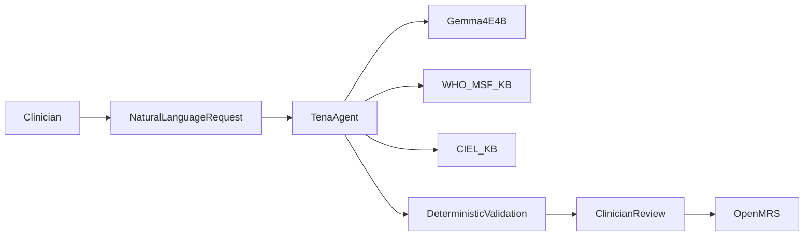
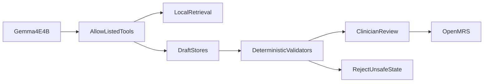

# TenaOS Technical Summary

TenaOS is a local-first clinical AI operating system for primary-care clinics. It turns natural language into standards-based digital health infrastructure: OpenMRS forms, structured notes, guideline-grounded decision support, patient education, and public-health reports.

The core design is simple:

**Gemma 4 E4B proposes. Local knowledge bases ground. Deterministic middleware verifies. Clinicians approve. OpenMRS persists.**

## What Makes TenaOS Different

Most digital health systems assume an implementation team: someone to configure forms, map concepts, validate terminology, build reports, and maintain local workflows. TenaOS moves that work into a local AI-assisted operating layer while preserving standards and human review.

## Local Runtime

TenaOS ships as a single local stack with:

- OpenMRS Reference Application 3,
- React clinical workspace,
- TenaAgent orchestration service,
- Gemma 4 E4B served through `llama.cpp`,
- Qdrant vector database,
- WHO/MSF guideline retrieval service,
- CIEL terminology retrieval service,
- MariaDB for OpenMRS.

Nothing in the core clinical workflow requires cloud inference after artifacts are downloaded.

For this submission, the runtime is Gemma 4 E4B BF16 GGUF served through `llama.cpp` with the Gemma multimodal projector for audio input. Quantized or removed runtime artifacts referenced elsewhere in the repository are not the submission runtime.

## Local Knowledge Bases

TenaOS has two local knowledge systems.

**WHO/MSF guideline KB:** built from WHO and MSF clinical guidance. PDFs are extracted with Pulse OCR, normalized into markdown and Docling JSON, chunked by document type, enriched with recommendation metadata, embedded with EmbedGemma 300M, indexed with BM25 sparse vectors, and stored in Qdrant.

Measured local artifact: 401 chunk files and 69,476 guideline chunks.

**CIEL terminology KB:** built from an OpenConceptLab CIEL export. The local SQLite store contains concept bundles, names, synonyms, answers, set members, mappings, datatypes, retired flags, and FTS5 search text. A semantic Qdrant index adds SapBERT dense vectors and BM25 sparse vectors for plain-language discovery.

Measured local artifact: 58,687 concepts, 298,905 mappings, 8,545 Q-and-A edges, and 3,259 concept-set edges.

## GEPA First, Data Infrastructure for LoRA Second

TenaOS uses GEPA optimization first because many clinical-informatics failures are tool-use and instruction failures: the model searches with the wrong phrase, selects a weak concept, misses a datatype constraint, or stops before enough evidence is gathered.

GEPA optimizes the actual prompts used by the production form-builder pipeline. It does not train on a toy surrogate. The offline wrapper runs the real pipeline under candidate prompt overlays, scores outputs with deterministic CIEL coverage and schema-validity metrics, and exports optimized prompts for runtime use.

LoRA/SFT comes after GEPA as completed adaptation data infrastructure. The LoRA data factory creates validated form, report, and scribe data so adapter training runs can learn clinical-informatics behavior: better search phrasing, uncertainty handling, tool sequencing, and standards discipline.

## Core Features

**Form Builder:** a clinician describes a form. TenaAgent reviews the workflow, builds a question worklist, resolves fields to CIEL, validates concepts and datatypes, builds an OpenMRS schema, and leaves final publication to the clinician.

**Scribe:** a text or voice note becomes SOAP sections plus structured diagnoses, observations, and medications. CIEL-coded items are resolved and reviewed before chart entry.

**Clinical Decision Support:** Gemma searches the local WHO/MSF KB and produces cited CDS cards. The model is not allowed to answer as an unrestricted medical authority.

**Patient Education:** TenaOS drafts patient-facing instructions grounded in retrieved evidence, ready for clinician editing, translation, printing, or sharing.

**Reporting:** a plain-language question becomes a validated report spec. Middleware compiles the spec into deterministic FHIR query plans and derives results from actual OpenMRS data.

## Evidence Snapshot

| Evidence | Status |
| --- | --- |
| Single-container local runtime with OpenMRS, Gemma 4 E4B, TenaAgent, Qdrant, CIEL, and WHO/MSF KB | Implemented |
| WHO/MSF KB with 69,476 chunks | Measured |
| CIEL SQLite with 58,687 concepts | Measured |
| LoRA/SFT corpus with 16,005 validated task-tagged traces | Measured |
| Form-builder baseline: 147/147 completed, 0 failures, 0.993 schema-valid rate | Internal technical evaluation |

## Safety Boundary

TenaOS is designed for clinician-in-the-loop use: local knowledge bases ground the output, deterministic middleware verifies it, and clinicians approve clinical artifacts before persistence.

## Read More

- Full technical report: `docs/technical-report.md`
- System card: `docs/system-card.md`
- Evaluation protocol: `docs/evaluation/evaluation-protocol.md`
- Evidence ledger: `docs/evaluation/evidence-ledger.md`
- Diagram source: `docs/technical-report-assets/architecture-diagrams.md`
